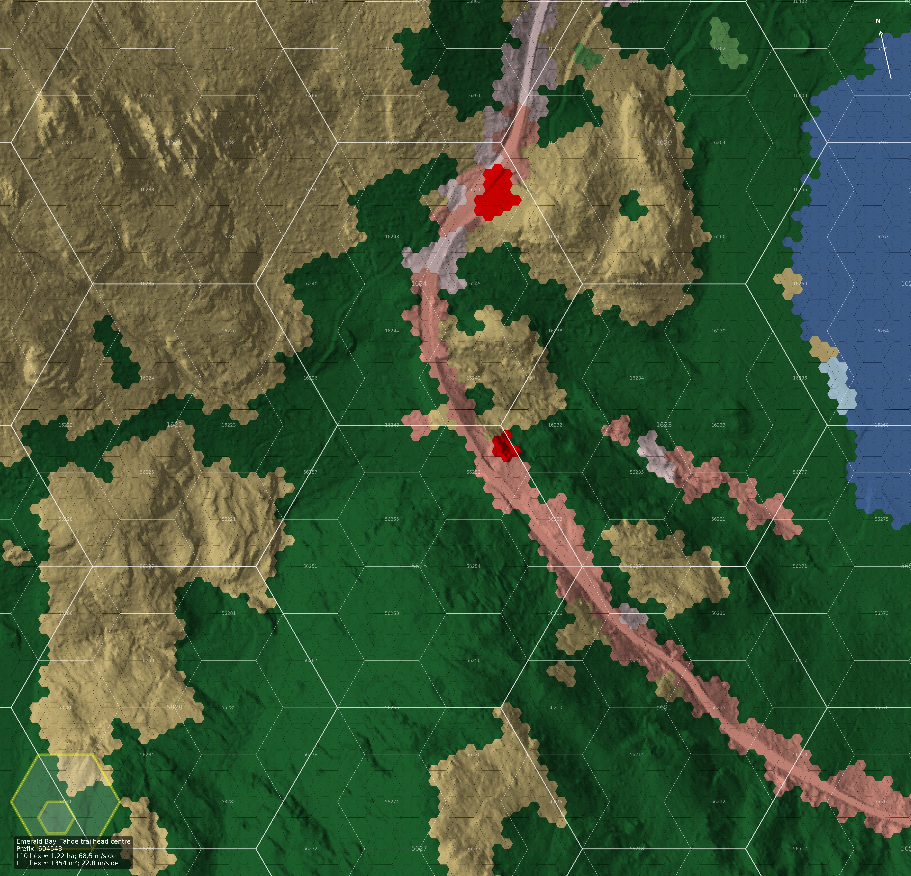
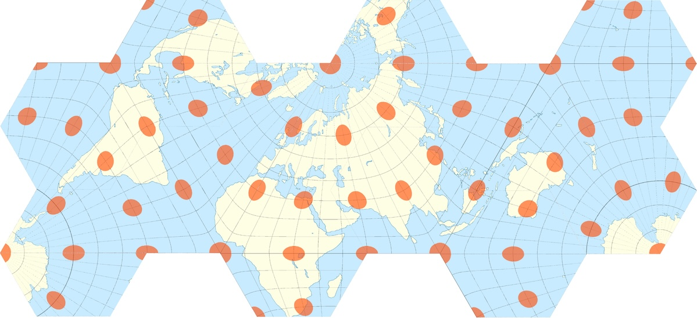
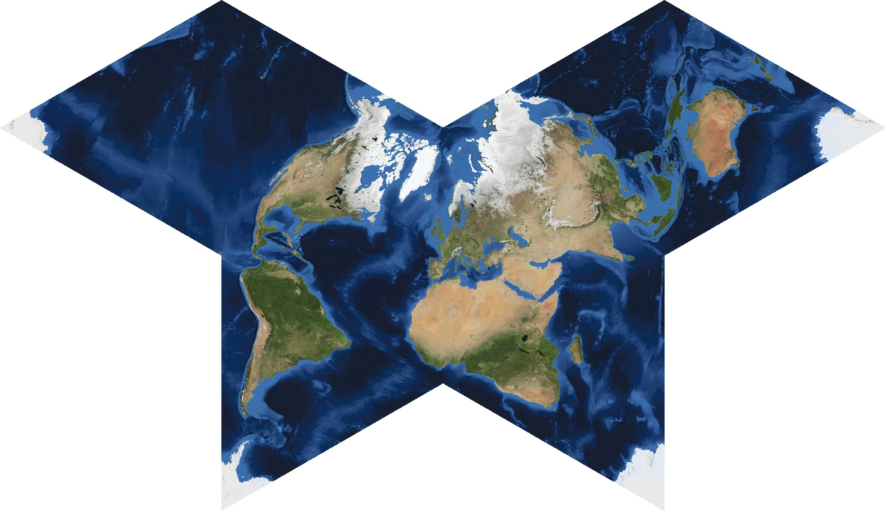

## Hex9.
`Hex9` is an **ongoing project** exploring (and developing) a novel 
*hierarchical hexagonal grid* (`HHG`) system for global projections.
What makes it possibly unique is that it's a CRS, an HHG, and offering 
deterministic hierarchical spatial addresses whose geometry are 
derivable and whose hierarchy is globally exact.

Hex9 is a hierarchical spatial addressing scheme built on an 
octahedral triangular subdivision. 
Each additional digit subdivides space by a factor of nine, 
producing a hexagonal region hierarchy whose geometry and 
lineage are deterministically derivable from the address.

It is well-suited to population mapping, environmental modeling, heat-mapping, 
hex-binning, and other geospatial analyses.

#### Why hexagonal tiling
* Hexagonal tiling is unique among regular tilings: all neighbors share an edge.
* Hexagonal tiling corresponds to optimal circle packing.
* However...
  * Hexagons cannot be tiled with hexagons.
  * The sphere cannot be covered by hexagonal tilings
* So, although ideal HHG have a long history in geospatial modeling...
  * Most global HHG are either flat or approximate, or not entirely hexagonal.
  * Existing approaches involve trade-offs, such as
    * Approximating the sphere with slight distortions.
    * Limiting the number of hierarchical layers.
    * Supporting only partial support for transitions between layers.
    * Deriving the hexagonal grid from spherical geometry
    * Needing precomputed databases of fixed points.
    * Requiring additional polygon types (commonly pentagons) for closure
* **Hex9** presents a *new* approach to the “holy grail” of HHG; It aims to 
  reduce some of these constraints while remaining early-stage and not yet  
  production-ready (Winter 2025).

### Why Hex9
#### Grid-Projection Decoupling
The Hex9 grid approach is *fully decoupled from any underlying global 
projection*.
This separation ensures:
 * The grid can be reused across projections without loss of structure.
 * Analyses and visualizations remain consistent, regardless of map 
distortions in the underlying projection.

#### Accuracy
Hex9 supports near-lossless forward and inverse mappings between 
grid addresses and geodetic coordinates. 
Accuracy is maintained even at extreme resolution: At layer 30, hexagons are 
on the order of 1µm. Example round-trip accuracy for several landmarks:

#### Addressing
*Current* Grid address semantics are as follows.
The Great Pyramid at Giza is identified at 29°58'45.817792004858"N, 31°8'3.457294813097"E
This can be projected to a (reversible) hex-grid address at any given layer.
Here it is at layer 36: `0070143470686461861005464283175018506`
Broken down...
`0-0701434706864618610054642831750185-06`
The first digit is the root hexagon at layer 0.  
This is one of 12 hexagons that cover the earth's surface, so the range of 
values are 0...B (where A,B = hexagons 10,11 respectively).
The main body, `07...185` is the sub-hexagons at each respective 
layer; so as there are 35 of those, along with
the root hexagon, we know this address is at layer 36.
`06` - these act as 'metadata tail', and provide the minimum amount of metadata to convert the address back to
its longitude/latitude. (The calculations for this are found in h9/addressing.py).

There is also a 'key' version of the address.  
A key is used for identifying which points are within a specific hexagon
when hex-binning (a main purpose for this sort of grid). In this case, the 'metadata tail' is reduced.
In this case, the great pyramid is:
`0070143470686461861005464283175018500`
Importantly, and despite best efforts,
the hexagon key of a higher layer cannot be solely derived by chopping the string.
The c2 identity is an important aspect for decoding ids 6,7,8
Likewise the octant face mode is very useful.
For the first 11 layers, the pyramid address key is as follows.
0:00
1:002
2:0072
3:00704
4:007012
5:0070140
6:00701430
7:007014344
8:0070143474
9:00701434700
10:007014347064

#### Round-trip errors of <7 nanometres (globally)

**Great Pyramid**
```
29°58'45.817792004858"N, 31°8'3.457294813097"E (Reference Coordinates)
29°58'45.817792004871"N, 31°8'3.457294813071"E (Roundtrip Coordinates)
0070143470686461861005464283175018506 (L35 Grid Address)
∂0.984436nm (roundtrip via GCD<->Hex9 Label) in Geodesic distance (nanometres)
```

**Stonehenge**
```
51°10'43.672800075871"N, 1°49'34.283450385600"W (Reference Coordinates)
51°10'43.672800075845"N, 1°49'34.283450385640"W (Roundtrip via Grid Address)
4352164061084274326815104253457062812 (L35 Grid Address)
∂1.314516nm delta (Geodesic.DISTANCE)
```

#### Intuitive uint64 Addresses
Hex9 supports various `uint64` addresses in a directly intuitive manner.

For example, one of the Nazca Spirals - at `14.679806S, 75.101925W` has the
uint64 address `0x8515044362475050` (in hexadecimal).
This is (by default) a 'Layer 13' Address; The hexagons are in bytes 0..13
The final byte is meta, used to convert the address back to another 
location.

```
0x85150...
  ↑↑↑↑↑
  ||||└─── Layer 4, hexagon 0
  |||└──── Layer 3, hexagon 5
  ||└───── Layer 2, hexagon 1
  |└────── Layer 1, hexagon 5
  └─────── Layer 1, hexagon 8
```
When the uint64 address is depicted in hexadecimal, the global address is
revealed and may be readily eye-balled with a crib - see the following image
that traces the first 5 regions 8,5,1,5,0 - each one covering 1/9th the area of
the preceding layer.

The layer area formula is straightforward: For The surface area of the Earth 
E, the area covered by a hexagon at layer L is E/(12*9^N)

Hex9 is highly comprehensive, natively supporting uint128 addresses (32 
nibbles) (as strings) and uint64 addresses (16 nibbles) (as integers). 
The former can index the globe down to Layer 28 or more. While Layer 36 is not 
the mathematical limit (going deeper merely requires specific hardware 
architecture) its resolution is staggering. By Layer 30, the area of a single 
hex is roughly 1,000 square nanometers (1,000 nm²)
This ensures Hex9 should be sufficient for most conceivable global 
mapping use cases.

#### Summary
Thanks to its decoupled, fractal-based structure, 
Hex9 allows direct projection of spatial data onto hexagonal grids. 
This enables visualizations where hexagons remain undistorted regardless 
of the underlying map projection, as shown in this Lake Tahoe Land Usage 
at Layers 10 (3 acres) and 11 (addressing), 12 (land usage), and 14 (DEM 
hillshading)

(*Lake Tahoe Land Usage*)

#### What can I find here?
This project includes:
 * Documentation and analysis of Hex9.
 * A working Python implementation of the grid, precise to sub-micrometre accuracy using geodesics.
 * Unit tests for the H9 Grid Engine.
 * Examples and tutorials demonstrating how to use the grid for various geospatial tasks.

#### Where next?
 * Detailed documentation explaining how the grid is structured and derived.
   * [Introduction](introduction.md) (way out of date!)
   * [Enumeration](enumeration.md) (way out of date!)
   * [Early thoughts](assets/docs/past.md) (even more out of date!)

 * Step-by-step guides for the included examples.
   * [Examples](examples/examples.md) — updated for 0.1.1a1
     - heatmap examples (hh_heatmaps) have not been re-tested.



#### What can I do?
 * Explore the grid and have fun experimenting with it.
 * Mention this project with your buddies!
 * Suggest improvements to enhance understanding or usability.
 * Contribute bug fixes or enhancements via pull requests.

### Why NOT H9?
  Needless to say, Hex9 is a self-funded solo project which is written as a 
  proof-of-concept and demonstrator, to show that there are still many new 
  approaches to the HHG question.
  Hex9 is not trying to compete with other HHG systems - it only aims to 
  offer another approach, which works really well for grid layer transitions.





