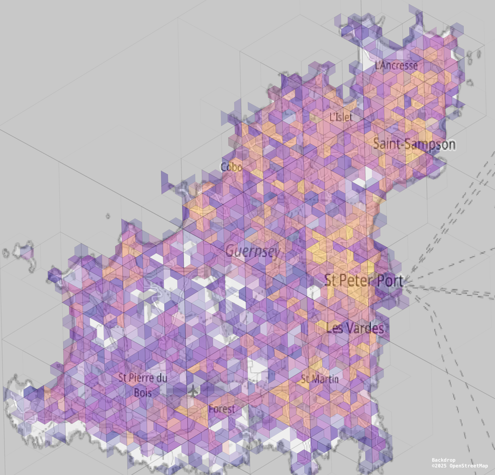
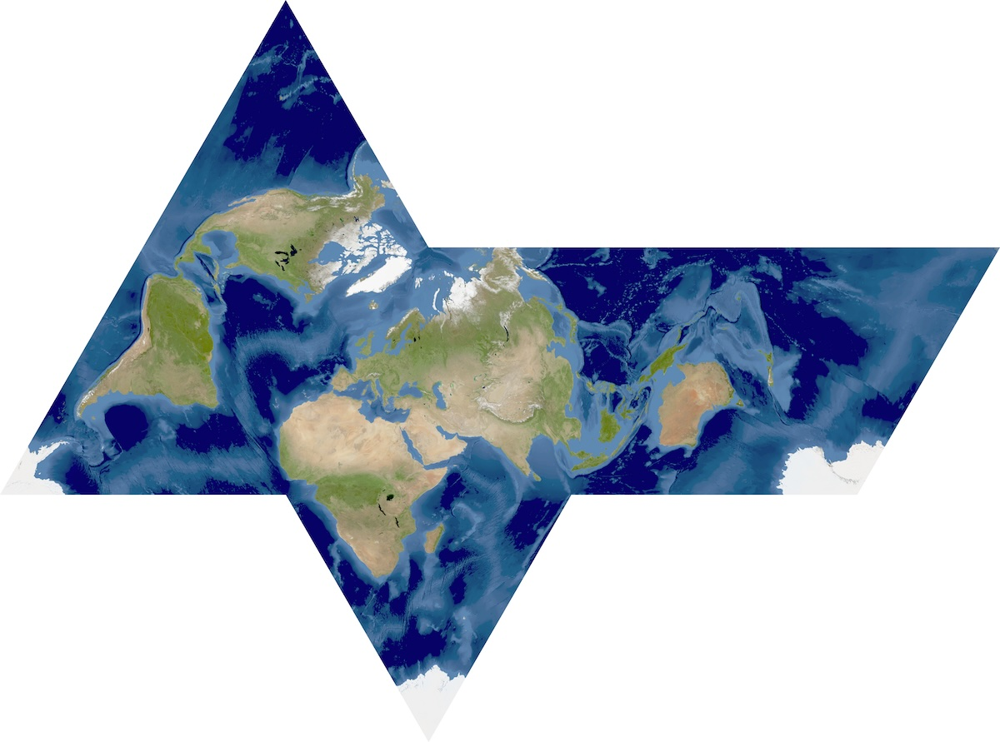

## Hex9.
Hex9 is an ongoing project that exploring (and developing) a novel 
*hierarchical hexagonal grid* (`HHG`) system for global projections.
It is well-suited to population mapping, environmental modeling, heat-mapping, 
hex-binning, and other geospatial analyses.

#### Why hexagonal tiling
* Hexagonal tiling is unique among regular tilings: all neighbors share an edge.
* Hexagonal tiling corresponds to optimal circle packing.
* However...
  * Hexagons cannot be tiled with hexagons.
  * The sphere cannot be covered by hexagonal tilings
* So, although ideal HHG have a long history in geospatial modeling...
  * Most global HHG are either flat or approximate, or not entirely hexagonal.
  * Existing approaches involve trade-offs, such as
    * Approximating the sphere with slight distortions.
    * Limiting the number of hierarchical layers.
    * Supporting only partial support for transitions between layers.
    * Deriving the hexagonal grid from spherical geometry
    * Needing precomputed databases of fixed points.
    * Requiring additional polygon types (commonly pentagons) for closure
* **Hex9** presents a *new* approach to the “holy grail” of HHG; It aims to 
  reduce 
 some of these constraints while remaining early-stage and not yet  
  production-ready (Summer 2025).

### Why Hex9
#### Grid-Projection Decoupling
The Hex9 grid is *fully decoupled from the underlying global projection*. 
The logical hex grid exists independently of any coordinate reference system and
can be applied within any octahedral global projection.
While Hex9 comes with a derived projection for this project, the grid itself is 
projection-agnostic, while the derived projection relies on the Hex9 grid
 for root-finding operations.

This separation ensures:
 * The grid can be reused across projections without loss of structure.
 * Analyses and visualizations remain consistent, regardless of map 
distortions in the underlying projection.

#### Accuracy
Hex9 supports near-lossless forward and inverse mappings between 
grid addresses and geodetic coordinates. 
Accuracy is maintained even at extreme resolution: At layer 30, hexagons are 
on the order of 1µm. Example round-trip accuracy for several landmarks:

**Great Pyramid**
```
29°58'44.985076680004"N, 31°8'3.346883880003"E (Reference Coordinates)
EAV484520284815335765361106218588821C2 (Grid Address)
29°58'44.985076680016"N, 31°8'3.346883879965"E (Roundtrip via Grid Address)
∂1.028579nm delta (Geodesic.DISTANCE)
```

**Stonehenge**
```
51°10'43.672800075871"N, 1°49'34.031280757836"W (Reference Coordinates)
NWΛ013572475462870330106251202683087C4 (Grid Address)
51°10'43.672800075819"N, 1°49'34.031280757874"W (Roundtrip via Grid Address)
∂1.314516nm delta (Geodesic.DISTANCE)
```

**Moai on Rapa Nui**    
```
27°7'32.827199567155"S, 109°16'36.740870832014"W (Reference Coordinates)
SWΛ145666784771136056604063805344505A7 (Grid Address)
27°7'32.827199567155"S, 109°16'36.740870832014"W (Roundtrip via Grid Address)
∂0.000000nm  delta (Geodesic.DISTANCE)
```

**North Pole** (edge case)
```
90°0'0.000000000000"N, 0°0'0.000000000000"E (Reference Coordinates)
NAV333333333333333333333333333333324G3 (Grid Address)
89°59'59.999999999847"N, 50°11'39.944067845317"E (Roundtrip via Grid Address)
∂4.761801nm  delta (Geodesic.DISTANCE) 
```

#### Performance
Hex9 efficiently handles large datasets. For example, *25 million sparse 
GCD points can be mapped in under 20 minutes* on standard desktop hardware. 
Non-sparse datasets are processed much faster.

#### Summary
Thanks to its decoupled, fractal-based structure, 
Hex9 allows direct projection of spatial data onto hexagonal grids. 
This enables visualizations where hexagons remain undistorted regardless 
of the underlying map projection, as shown in this Guernsey population heatmap.

(*Guernsey population heatmap*)

#### What can I find here?
This project includes:
 * Documentation and analysis of Hex9.
 * A working Python implementation of the grid, precise to sub-micrometre accuracy using geodesics.
 * Unit tests for the H9 Grid Engine.
 * Examples and tutorials demonstrating how to use the grid for various geospatial tasks.

#### Where next?
 * Detailed documentation explaining how the grid is structured and derived.
   * [Introduction](introduction.md)
   * [Enumeration](enumeration.md)
   * [Early thoughts](assets/docs/past.md)

 * Step-by-step guides for the included examples.
   * [Examples](examples/examples.md)

#### What can I do?
 * Explore the grid and have fun experimenting with it.
 * Mention this project with your buddies!
 * Suggest improvements to enhance understanding or usability.
 * Contribute bug fixes or enhancements via pull requests.




