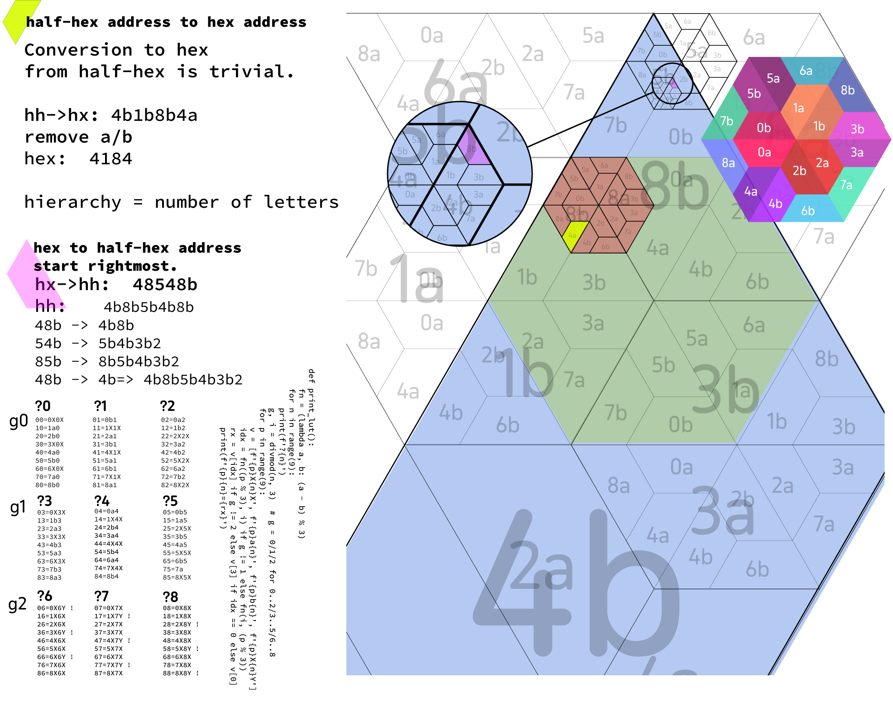

Up until now this has mainly been a repository of ideas in progress.
The project is centred on the idea of hierarchic hexagonal grids, while keeping the number of polygons to a minimum.

My solution to this quandary is to use half-hexagons ('regular' trapezoids composed of three equilateral triangles) as
the primary fundamental.  This can be used in a vertex centred / offset 'H9 aperture', where any hexagon can be subtended into 
9 smaller hexagons, albeit with three hexagons shared directly along the half-hex line. 
('Apertures' normally remain shape centred. Here we do not do that.)

This is auxiliary to the work that has been done by many others, including Buckminster Fuller, and Snyder at Oregon University,
regarding hexgrids in general, as well as discrete global grids (ISEA DGGs), but my focus is more on general 2D grids, 
rather than just global mapping - also, the grid I use here is vertex centred,
whereas most research has been developed on hexagon-centred hierarchic grids.

How about H3?  Back in 2010 I worked on grids very similar to H3, while examining the √7 rotation of each 
level of the hierarchy leading to an approximate correspondence along the edges.

However, I didn't like the ragged-edge issues that this sort of rotated hexgrid introduces and, again, 
the entire grid is oriented at each level of the hierarchy. It works well enough for one or two layers, but it does 
not easily allow fine resolution - nor is it easy (when in a ragged edge) to work out it's hierarchy.

So I gave up on that, and more recently worked on this half-hexagon solution.

Here is the basic unit hexagon, showing it's division into the 18 half-hexagons that compose it.  The numbering is one
way of indexing the half-hexagons.

A hexagonal grid hierarchy can be seen below, with the outer hexagon in white, 
then the successive lower hierarchies in green, blue and red. The hierarchy is unlimited in depth.

This method can be used on any map projection - ad it is a space partitioning mechanism rather than a projection, but
it lends itself particularly well to the Dymaxion (and similar) icosahedral maps. Here one can see my hometown (London)
marked out in yellow.

Grid referencing.
Likewise, we can use an address system that resolves hierarchy and location extremely easily. One thing that I like is
that we can use subtended regions rather than axis-oriented addresses. Why is that nice?  It offers a few benefits
- first of all there is only one string (unlike, EG lat/long or OS grids - which still confuse those not familiar with 
), and where locality can be kept relevant without having to consider a remote origin.

Another 'feature', is that from any given root, the length of the address tells us about the level of hierarchy. 
Moreover, merely by shortening the address, we may derive the parent.

Grid coordinates are best done, for this, using base 9, and using a signifier for the half-hex specialisation.
One can work out the entire half-hex address from a given hex address - but it does require following some rules.

Here we see a hierarchic grid addressing system.  The 'a/b' of each half-hex could be replaced with
symbols, but the point is that we only need to store the final half-hex place (when we have one), as 
we can derive the ancestral half-hexagons according to the address we are given.

This is recent work - so it's even more chaotic than other stuff.

