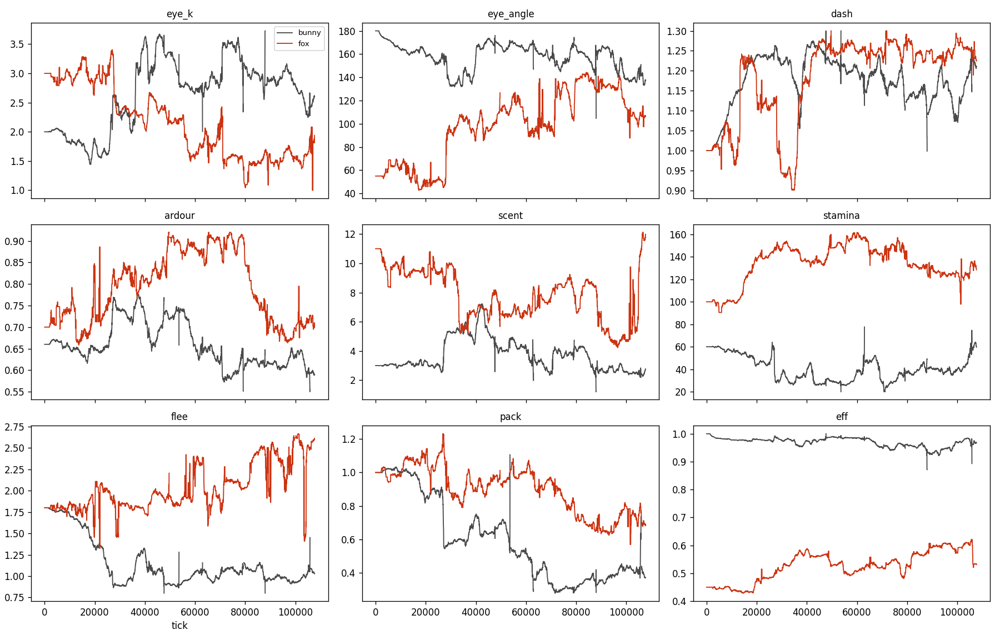

# Hexen: what a fox and a rabbit taught the grid

*Notes on the ex_0510 → ex_0512 journey, 2026-08-08/10.  Companion to
`examples/ex_0511_hexen.py` (the object-per-animal reference) and
`examples/ex_0512_hexen_vec.py` (the vectorised engine).*

Hexen began in 2012 as a Java/Swing fox-rabbit-grass toy on a toroidal
hex grid, was revived in 2026 on the hex9 field verbs, and over two
days of iteration became something else: an instrument that generates
ecological and evolutionary findings neither the code nor its authors
specified.  This note records what was built, in what order, and —
more usefully — what the journey taught.  The findings below rest on
single long runs unless stated otherwise; the project's standing rule
(three seeds or it didn't happen; and its twin, coined en route: the
right horizon or it didn't happen) applies to every claim.

## What was built, briefly

- **Struct-of-arrays engine** (`Herd` column banks, uid-sorted;
  field interned to int32 hex ids; occupancy by bincount + CSR;
  per-hex sight cache as boolean rows) — ~4× the reference engine at
  equal populations, ~15× at boom scale, and it holds 60+ ticks/s
  where the object engine drowns.
- **Grid-native motion**: position IS a hex9 address at
  `MOTION_LAYER = LAYER+3`; a tick's movement is integer
  neighbour-steps chasing a persistent *ideal point* ("vector intent,
  grid actuality"); passability by `cell_ancestor` ownership; walls
  snap intent; a jump-when-clear fast path makes the motion layer's
  grain nearly free.
- **An ecology of costs, not rules**: stamina reserves with winded
  hysteresis; grass scarcity as a Holling-II mouthful; senescence as
  rising upkeep; motion-tuned prey vision (a still fox is 0.4× as
  noticeable — the ambush niche); sex-dimorphic ardour expression;
  a cohesion band (repelled inside 6 pitches, lonely beyond 8).
- **A nine-gene genome** — eye_k, eye_angle, dash, ardour, scent,
  stamina, flee, pack, eff — several of them former constants
  promoted on the observation that the field should set them.
- **A metapopulation**: 3, 7, 9 ("wings") or 19 walled demes on a
  super-hex lattice, joined by tunnel doorways one cell wide; every
  gate machine-verified passable at init; doors-sealed test proves
  the walls airtight.
- **Conservation machinery that respects the ecology**: local
  respawn split across the two farthest demes; relict recolonisation
  from a diversity-bearing pool (snapshotted as a line falls through
  a viability threshold, never from the last survivor); lean,
  desynchronised founders; rescue-as-company for lone survivors.
- **Instruments**: extinction log (each dying line's full genome,
  each founding's size/place/stock), per-deme genome census,
  all-gene time series (`hexen_genes.tsv` + panel figure), and —
  by accident of design — two unread genes serving as pure drift
  controls.

## The exhibit



*Nine-gene medians over the 107k-tick, 19-deme lean-founder run
(grey = bunny, red = fox).  Readable directly off the panels: the
dash–dash arms race; the eye_k crossover where predator and prey
swap sensory niches (~tick 27k); fox eff climbing off its old
ceiling once fox-line extinctions ceased; fox pack decaying through
the rescue-as-company era; and the unread flee/pack drift controls
calibrating how much motion is noise.*

## The learnings

### 1. Hex9: the hierarchy is an architecture, not an address scheme

The load-bearing pattern was **coarse plan, fine transition**, and it
recurred at every scale: grass grows a layer finer than animals walk;
scent buckets a layer coarser; motion three layers finer; demes on a
super-lattice above the field; the jump-when-clear path consults the
walk layer so the motion lattice is only ever *instantiated* where
the plan is contested.  Every process at the grain it deserves, all
of it a re-bin of one uuid.

Two companion lessons.  **Vector intent, grid actuality**: symbolic
positions work, but choosing each micro-step by heading alone
quantises travel to the six lattice axes — motion must chase a
persistent continuous intent, with the grid as truth and walls
snapping intent back.  And **lineage ≠ ownership is a practical
matter**: address truncation, point-binning and `cell_ancestor`
disagree exactly at boundaries, and each disagreement produced a real
bug (newborns with no residency at field edges) before the ownership
doctrine was applied uniformly.

### 2. Engineering: scale exposes asymptotics that small worlds forgive

Every performance crisis was a hidden super-linearity behind a small
n: a BFS whose frontier lacked per-wave dedup (fine at 750 cells,
exponential — and gigabytes — at 4,500); an all-pairs haversine mate
board (fine at 200 rabbits, ~7 GB of temporaries at a 12k boom); a
wheel call per micro-step (fine at 27 steps/pitch, prohibitive at
81).  The cures were three moves applied repeatedly: compute static
field furniture once; batch the wheel; bound the working set (chunked
matrix products, f32 where f64 buys nothing).  Peak memory fell from
15 GB to under 2 GB while the world grew five-fold.

### 3. Methodology: instruments, controls, horizons, and the safety net

- **Windows lie like single seeds do.**  A 9k-tick window read as
  "foxes too strong"; the 112k continuation inverted it.  "Zero
  extinctions at 10k" died at 11.3k.  Verdicts need the horizon that
  matches the dynamics, and this system's dynamics span tens of
  thousands of ticks.
- **Instruments precede findings.**  The greed ceiling existed for
  a hundred thousand ticks before the extinction log made it
  visible; the pack–boom phase relationship existed only in a TSV
  nobody had yet written.  Each observable added produced a finding
  within one run of its existence.
- **Unread genes are free drift controls.**  Fox `flee` and bunny
  `pack` are carried and mutated but never read.  Their wander
  calibrates drift; twice they stopped a noise-sized excursion in a
  read gene from being called a result.
- **Every safety mechanism becomes ecology.**  There is no neutral
  plumbing in a world with selection.  Global respawn synchronised
  collapses; one-deme cohorts were a predation shock that halved
  themselves; full-bellied founders burst synchronised litters; and
  rescue-as-company — within 100k ticks — bred sociability *down*
  (pack 1.0 → 0.68), because the subsidy removed loneliness's death
  penalty.  The deus ex machina is a species in the ecosystem, and
  evolution will farm it.
- **Fragility is conserved.**  Solving fox persistence (one true
  extinction in 107k ticks) moved the collapses to the rabbits (six
  in the same run).  Stability is a property of the whole system;
  pressing on one species relocates the bottleneck.

### 4. What the field did on its own

Nothing selects the animals; the field does — and it out-designed
its designers repeatedly.

- **Red Queen, visibly.**  Bunny and fox `dash` climbed 1.00 → 1.25
  in lockstep, never ~0.03 apart, for 27k ticks.  Strategy cycled
  courser → ambusher → courser as prey vigilance answered each form.
- **A sensory niche swap.**  Given only motion-tuned prey vision,
  the fox abandoned its telescope (eye_k 3.0 → 1.9, half-angle 55°
  → 107°) and became an olfactory endurance hunter, while the rabbit
  became the visual specialist — and, since the fox no longer
  looked, a bold one (flee 1.8 → 1.0).  Different seeds found
  different prey attractors (bold-and-fast vs skittish-and-sighted)
  against the same predator.
- **A greed ceiling set by extinction rate.**  Trophic efficiency
  (`eff`) — individually always worth raising — stayed bounded at
  ~0.48 across ~30 dying lineages and four distinct ecological
  regimes while fox-line extinctions did the culling, and climbed to
  0.53–0.60 in the one run where those extinctions ceased.  Group
  selection against over-efficiency, requiring exactly the deme
  structure the trefoil was built to provide, with the ceiling's
  height tracking the culling rate.  (Caveat: the final climb is of
  drift-comparable magnitude per se; the evidence is the cross-regime
  contrast.)
- **Sociability leads the boom.**  The heritable pack disposition
  correlates with fox abundance at +0.51 (drift control: +0.18),
  peaking with the gene ~250 ticks *ahead* of the population —
  suggesting booms are made by sociable lineages rather than
  sociability being taught by lonely ones.  One seed; suggestive.
- **Space stabilises asymmetrically.**  The predation wave needs a
  world larger than its own wavelength (19 demes rotate where 7
  synchronised), but area dilutes the predator: the Allee constraint
  — finding a mate — scales with the map, and courtship itself
  became the dispersal engine (dimorphic males cheap to convince,
  scent crossing walls, hunger pushing and love pulling toward
  exactly the demes that can feed a litter).

## The loop that did the work

The productive cycle was consistently: watch the live run; name what
looks wrong *as natural history* ("foxes headbutt walls", "the
vixens spawn arduous", "loneliness is such a drag"); implement it as
a cost or a physics, never a scripted behaviour; give it two sides so
selection can price it; then measure whether the field agrees.  Every
mechanism that mattered went through that loop, and several came out
the far side doing things no one asked of them.

## Open

- The moral-hazard policy question: should company-rescue wait
  longer than true-extinction rescue, so pairing pays again — or is
  the subsidy this world's physics now?
- The prey-side frontier: serial bunny collapses suggest refuges
  (burrows — cover the fox's pounce cannot reach) as the next
  ecological verb.
- Standing candidates: interception/lead pursuit; walk-layer A*
  waypoints; per-deme (wall-occluded) scent; a stalk gait; fast- vs
  slow-twitch coupling of burst speed to stamina.
- And the standing debts: nothing here has three seeds yet, and the
  eff-ceiling and pack-lead results deserve them first.

## Were we to revisit: toward a general trophic engine

Design capital banked from the post-mortem discussion, in rough
order of leverage.

**Mass as the master gene.**  Allometry organises real life
histories: metabolism ~M^0.75 (big is cheaper per gram), storage ~M
(famine resistance ~M^0.25 — mass is a boom/bust buffer, the exact
failure mode of the serial rabbit collapses), lifespan and
generation time ~M^0.25, strength and bite ~M^2/3, detectability
~M^2/3.  One mass gene with those exponents dissolves the Fox/Bunny
class constants into consequences, and generates the whole r-vs-K
axis by itself.  Bonus coupling from physics: visual acuity is
bought in eye diameter, so focused distance vision *requires* mass —
the sense-cost question and the mass question are the same question.

**Deconflated senses.**  Replace eye_k/eye_angle with the actual
evolutionary stack: a light patch (near-free), a motion channel
(cheap — most prey vision), and a form/acuity channel (expensive,
mass-hungry, the only one that sees a *still* target).  The 107k
run's sensory niche swap happened because the conflated eye had to
be kept or dropped whole; a stack lets a lineage keep cheap motion
vision while shedding the dear fovea — and buys the ambush arms
race a real counter.

**Stillness as the first defence.**  The mirror mechanic to the
ambush fox: prey conspicuousness scaling with speed against the
predator's motion channel.  Freezing before flushing, with the
flight-initiation distance heritable.  Predicted outcome: crypsis
builds vs sprint builds as alternative prey attractors.  (Cheap in
the current engine — one conspicuousness gather in fox targeting,
symmetric to MOTION_VIS.)

**Cooperation as a hunting regime — with the social genes
deconflated.**  Mass makes cooperation earnable: give prey strength
~M^2/3 and make the mandown pin a contest (summed attacker strength
vs prey strength), and a rabbit can grow beyond one fox's capacity —
whereupon the only counter is arriving together.  But "sociality" is
at least four separable dispositions, each priceable through
existing budgets, none scripted:

- `space` — the current pack gene: how close you tolerate
  conspecifics living (the energy-source spacing problem);
- `join` — adopt a colleague's chase target (the minimal
  cooperative-hunting verb: no roles, no protocol, just piling on);
- `share` — suppress the territorial shun while feeding, so two can
  eat at one kill (bite-contention sharing already exists; this
  gene only gates standing together — and it is where the pack
  dissolves if it fails: the tragedy of the carcass).

No `align` gene: boids-style alignment codes the SHADOW of
cooperation rather than its substance — a fox that joins a chase
ends up running the same line, so aligned running should EMERGE
from join, and observing it in the data would then mean something.

Joining needs a coordination CHANNEL, and smell is the wrong one —
olfaction is integrative and minutes-scale, a medium for standing
facts (a doe in season, a territory), not events.  A hunt is an
event.  Two channels fit, with different grid physics:

- *Gaze-watching* — nearly free, its physics already built: a
  chasing fox is a fast mover, and fast movers are maximally
  salient to the motion channel (the same MOTION_VIS logic that
  hides the ambusher makes the sprinter a beacon).  Sight-join
  inherits occlusion, so terrain shapes the hunting culture: open
  demes can breed coursing packs, rocky ones loners.
- *Voicing* — giving tongue: a heritable propensity to cry while
  chasing.  Sound sits between light and scent on the grid: fast
  like sight, diffracting around hedges and through doorways like
  scent.  Its cost is not energy but an information LEAK — every
  rabbit in earshot is warned — so the gene is two-sided without an
  invented bill (pack canids voice; ambush cats are silent).
  Voicing would also make the current telepathies honest: the
  lonely-pull becomes a heard call (the howl), rally and
  recruitment share the medium, and prey eavesdrop on all of it.
  Which hands the rabbit its true weapon — rabbits are THE hearing
  animal, and a prey line investing in audition detects loud packs
  through walls: voicing vs prey hearing is a third arms-race axis
  in a third medium.

The full sensory economy is then three media with three physics —
light (fast, straight, blockable), sound (fast, diffracting,
two-edged), scent (slow, pervasive, wall-crossing) — and every
lineage allocating one budget across them.  Pack hunting is never
coded: it is what a lineage looks like when join/share (and
perhaps voice) drift high as a correlated block because giant prey
made each individually profitable.  If prey stays small they should
decay to the loner corner — either outcome is a result.  Note also:
join and share only pay at kills, so no rescue subsidy touches them
— their trajectories are honest where the spacing gene's was
confounded.

**The genome as an allocation tree.**  Mass at the base setting the
total budget (~M^0.75); each node dividing its parent's budget among
children; a gene = a ratio at a branch point; a capacity = a leaf's
arriving budget through its scaling law:

```
mass ──► total budget (~M^0.75)
├── CNS
│   ├── Senses
│   │   ├── Visual    ── Motion / Tracking / Recognition
│   │   ├── Auditory  ── (voicing's mirror: listening)
│   │   └── Olfactory
│   ├── Responses     ── reflex speed, flee triggers, freeze
│   └── Social/Cognitive ── join, share, recognition-use, space
├── Musculature       ── Burst / Endurance (fast/slow twitch)
├── Feeding           ── gut: intake rate, digestive efficiency
├── Breeding          ── gestation, milk, litter investment, ardour
└── Voicing           ── the two-edged channel
```

The decisive property: every trade-off is STRUCTURAL.  Investing in
Visual is divesting Auditory — sibling rivalry replaces every
invented cost, and the "give every gene two sides" discipline
becomes an accounting identity.  Three consequences flat genomes
cannot give: hierarchical pleiotropy (root-near mutations shift
whole suites coherently — rare large reorganisations, common leaf
fine-tuning, with mutation σ per depth); subtree crossover as
linkage (inherit a parent's whole CNS and strategies stay coherent
— the tree is the chromosome); and real-biology validation of the
rivalry classes (CNS vs Feeding as siblings IS the expensive-tissue
hypothesis).  It is also a second hex9-shaped idea: energy flowing
down an allocation tree to the leaf that spends it is coarse plan,
fine transition applied to a body instead of a field.
Implementation stays column-bank friendly — a flat float array
interpreted through the tree, sibling ratios normalised at read
time; the gene panels become a treemap over time; unread leaves
remain free drift controls.

**Speciation — the demes are 80% of it.**  Allopatric divergence is
already happening; add assortative mating (discount the scent
board's cosine by genetic distance) plus hybrid penalty or niche
separation, and the doorways become secondary-contact zones.  The
deep version dissolves the species boundary entirely: one
population-space with mass + sense-stack + spacing + eff genes and
an eating rule from physics (you may eat what is sufficiently
smaller, slower, catchable) — then herbivore, predator and
scavenger are regions of gene-space, and whether the world
discovers a trophic pyramid at all becomes the experiment.

**What carries over.**  The column-bank engine, the deme lattice
and its verification, the conservation machinery, the instruments —
and above all the method: genes price physics, never script
behaviour; give every gene two sides; keep unread genes as drift
controls; instrument before concluding; and let the field argue.
