# `H9` An hierarchic hexagonal grid

These notes are not fully complete, as they do not include the octahedral 
system. However, I will be finishing these notes soon.

This is a solution to the challenge of generating a hierarchic hexagonal grid.
While there have been many approaches to
this challenge over the last few decades, this solution (`H9`) may have
significant benefits over others that are more
well known.

# Why hierarchic hexagonal grids?

The motive for doing this is covered across many papers and even standards but,
in two sentences,

* The hexagonal tiling is unique amongst regular tilings in that all neighbours
  are edge on.
* The hexagonal tiling is identical to the best fit circle packing.

The underlying insight in *this (`H9`)* solution is that, while hexagons cannot
tile hexagons, a half-hexagon can be
tiled by half-hexagons.

Half-hexagons have a history of their own in tilings. In their chapter on
aperiodic tilings, Grünbaum & Shephard, (also
Baake et al.), bring note to some of the issues of using the 1:4 (50%)
hierarchy -

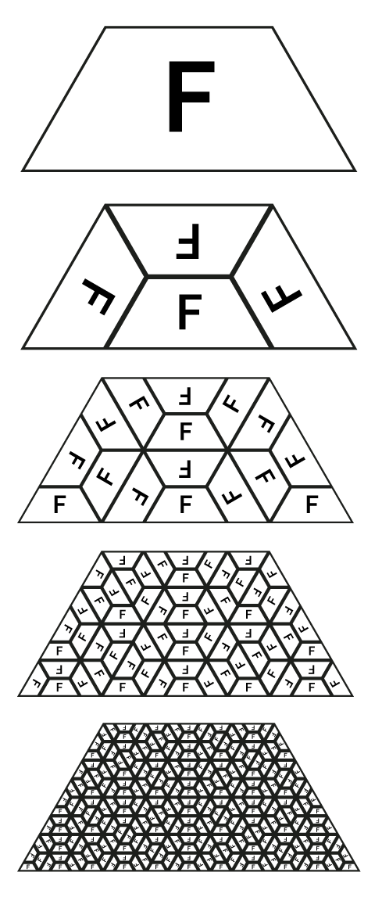

*<small>aperiodic half hexagonal grid</small>*

While aperiodic tilings are always interesting (cf. Penrose Tiling, and the
recent Aperiodic Monotile discovery by Smith
et al) I am not convinced they are so useful for GIS, mapping, or simulations
where a primary criterion of a hierarchic
grid is that it **is** periodic.

Nevertheless, if one were to ignore the underlying generator, such a grid could
be feasible, as the

However, the 1:9 (33.33%) hierarchy can offer a very strong regularity, and the
1:9 ratio is far more similar to the 1:
10 ratio we are used to on metrical / decimal grids.

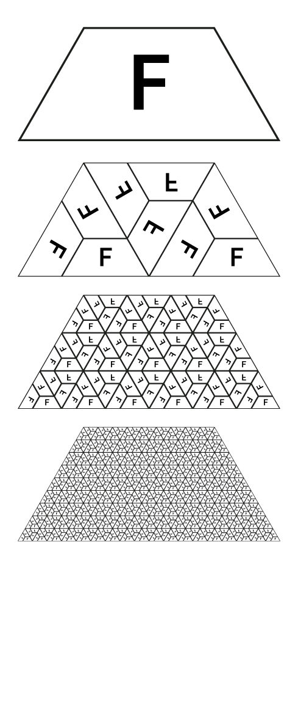

One aspect of the grid generator depicted above is that (unlike the 1:4) it is
not unique. In the course of writing
this, the enumeration of all 49 possible 1:3 tilings of the half-hexagon were
identified.
The image below depicts all of them. Of these, eight pairs (mirrors of each
other) can be used to tile the plane in
hexagons – and of those just one (as depicted above) has a symmetry other than
the wallpaper group `p1` - not only that,
but it has a symmetry `p31m` which works very well both on the plane may be 
 amended to fit a sphere (via an octahedron).

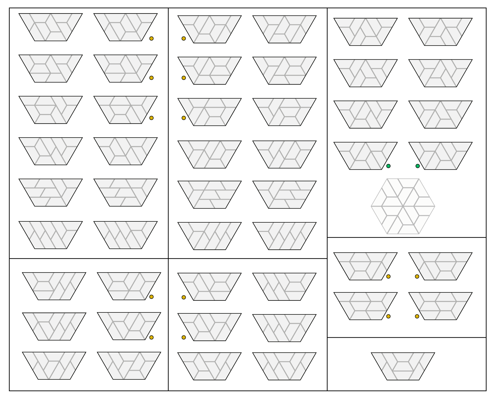

We can therefore determine that, as a candidate, this tiling of a half-hexagon
hierarchy might lend itself very well to
the purpose of generating a hierarchic hexagonal grid.

# Challenges

One is immediately drawn to a few potential setbacks.

1. The 'child' hexagons are split across the parents.
2. The use of mirrors in symmetry is not great for mapping.
3. The basic tile does not work on icosahedral spherical mappings.
4. A grid should provide meaningful, intuitive, enumeration such that generates
   a unique location.
   Let us address those in order:

# (1) The 'child' hexagons are split across the parents.

This is the case with *every* hierarchic hexagonal grid; however with `H9`
planar grid there are no new shapes other
than the half-hexagon and the hexagon; this lends itself to very deep
hierarchies without having to be concerned about
changes in orientation as one transposes from one level to the next.

Moreover, because there is no overlap (apart from the horizontal split), there
is very little ambiguity.
Using the symmetry of the underlying pattern as guidance, we can identify each
hexagon uniquely - but for the innermost
hexagon, it is salient - even necessary - to include the innermost half-hexagon
region. This will be examined in detail
later.

### Conclusion

Given that there is no means of tiling hexagons with hexagons, `H9` keeps the
discontinuity to a minimum, adding only
one new polygon - which is easily recognised. The addressing issue is important,
but will be examined later.

# (2) The use of mirrors in symmetry is not great for mapping

The symmetry (wallpaper group) `H9` is `p31m` - not `p6` (as found in hexagons).

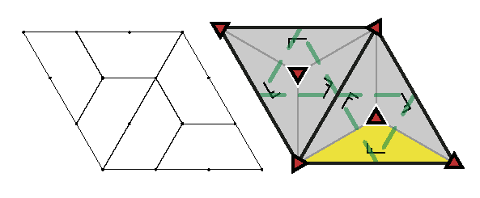

*<small>p31m wallpaper symmetry</small>*

The important aspect of the half-hexagons is that they provide the framework for
the hierarchic hexagonal grid. However,
the grid itself - at each level - is a hexagonal grid. Each grid hexagon is
easily divided into two half-hexagons
without adding any new vertices - each of which are, again divided into nine
half-hexagons themselves requiring only 11
new vertices, all of which are easily derived from the parent due to the three
equilateral triangles that they are
composed by.

Those 18 half-hexagons yield the entire outline of the hexagon child grid. The
symmetry of the half-hexagons is useful
for identifying enumerations (which themselves help us develop an addressing
schema), but the nature of the symmetry has
little to do with the actual map. However, there is a `side effect` of using
this symmetry, which is that there is an
implicit orientation (an 'up') built into the planar grid itself.

### Conclusion

The half-hexagon symmetry is only a structural component for the hierarchic
hexagonal grid it depicts.

# (3) The basic tile does not work on icosahedral spherical mappings.

The vertices of an icosahedral have an odd number of edges, while the H9 tiling
depends upon an even number in order to
match the hexagons that span across each side. This may well be a reason why the
tiling was discarded as a candidate in
the past; however it is well known (vis. Fuller's work on this - such as the
Dymaxion projection) that the spherical (or
spheroidal) mapping using icosahedra involves inflections that require a minimum
of 12 pentagons. This itself
demonstrates the complexity of using a hexagonal mapping of the sphere.
An alternative to the icosahedron/dodecahedron dual is the cube/octagon dual,
and we can find Octahedral projections
from the late 19th and early 20th century (vis. Lee/Cahill Butterfly maps, for 
example) or earlier.
While it requires more topological stretching (something that will be addressed
later) the octagon lends itself very
well to the human division of the sphere into hemispheres and octants.

Within the spherical symmetry groups, octahedral symmetry (Coxeter `[*432]`) has
many similar features to icosahedral (
Coxeter `[*532]`) - yet switching the '5' for a '4' addresses the exotic 
equatorial zigzag, and offers the even number of edges to each vertex that 
this sort of tiling requires.
Using the `H9` tiling on an octahedral base is pretty strong at (
Coxeter `[3+,4]`) - nevertheless it is a pyritohedral
symmetry (which itself uses roto-reflections - a 3D symmetry function which
reflects and rotates at the same time), however the octahedral tiling adds 
additional constraints to the enumeration of hexagons, which will be 
addressed later. 

As this is a grid system, it isn't tied to any particular methodology - but an
example of one projection onto the plane  is as follows

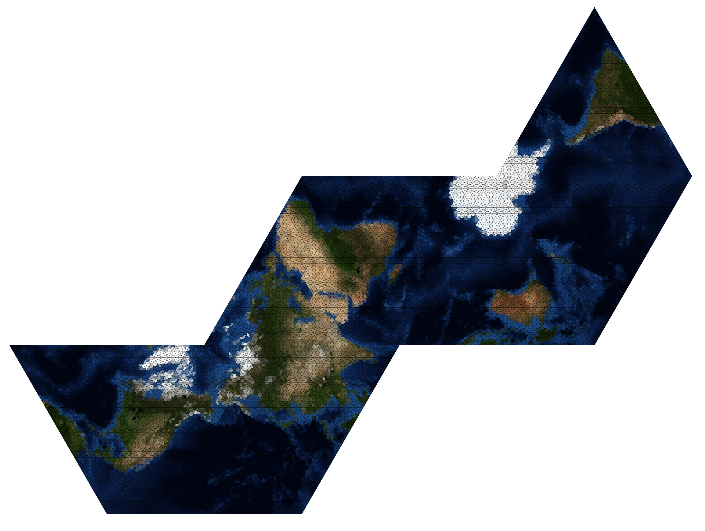

*<small>octahedral map projection</small>*

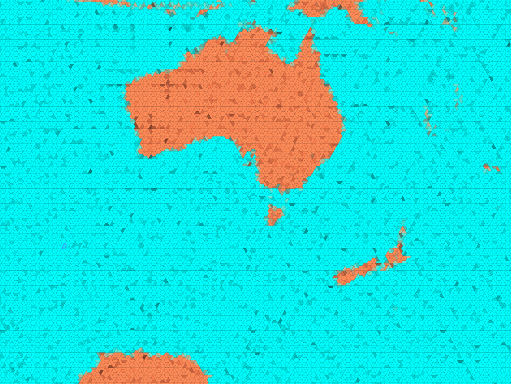

*<small>An octahedral detail of australasia, using the matplotlib
dataset.</small>*

For on-sphere maps we can begin to approximate near-equivalent areas.
As the underlying grid is a triangular subgrid of an octahedron it is possible
to use
various well-known means to optimise the grid to fit the sphere, such as Lloyd's
voronoi relaxation,
or force-directed methods such as kamada kawai.
The following is an example of the latter.

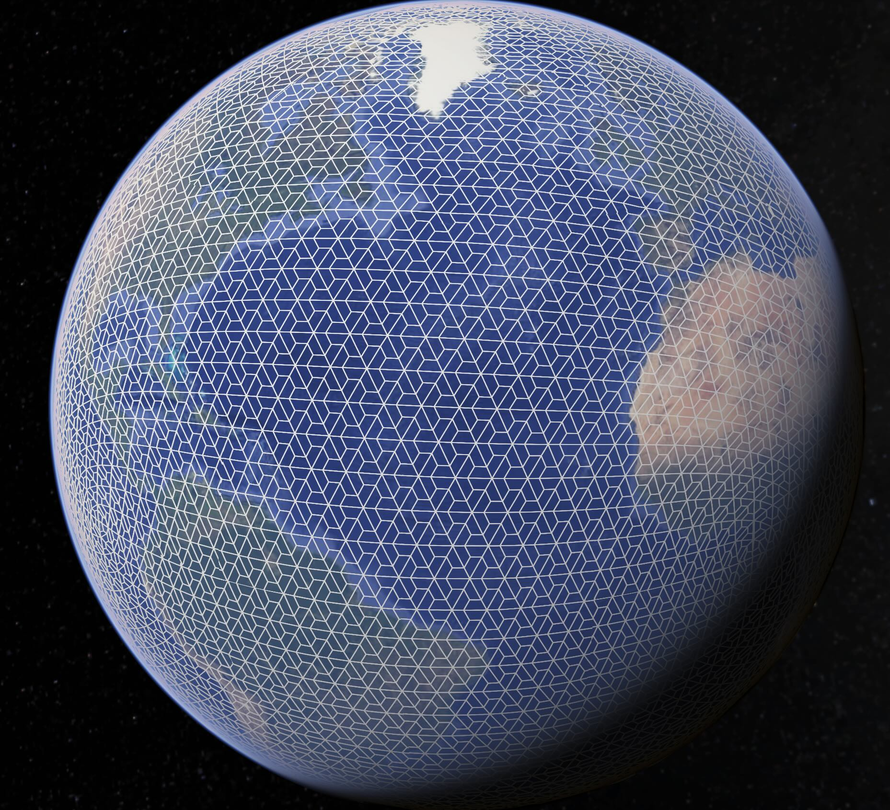

There are also analytic methods which approximate the force-directed mesh, such
as modelled by Anders Kaseorg.

### Conclusion

While `H9` does not map onto an icosahedron (for the simple reason that the grid
requires that each of the governing
polyhedron's vertices have an even number of edges) it lends itself very well to
mapping onto an octahedron, and does so
following well-known spherical symmetry, albeit it's enumeration will differ in
light of the constraints placed upon it
through its symmetry.

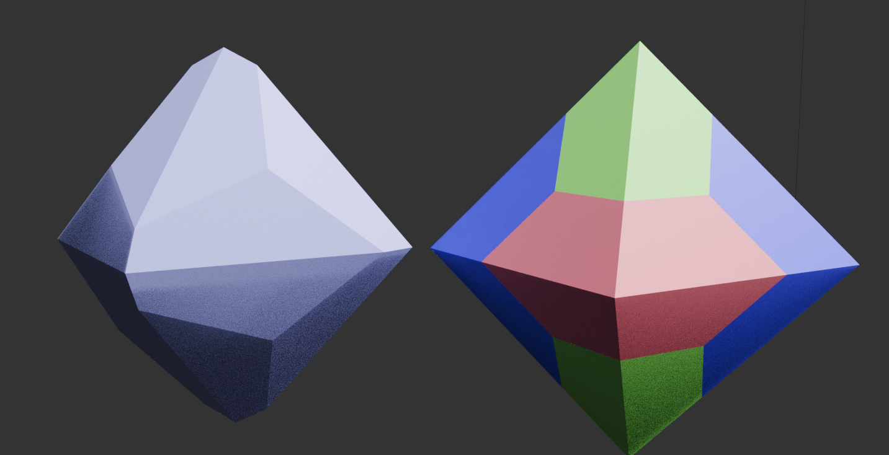

*<small>The di-dodecahedron (also known as a diploid in crystallography) is an
example of this symmetry.</small>*

# 4. A grid should provide meaningful enumeration

## Tiling the plane.
Starting with a parallelogram of six half-hexagons


*<small>p31m parallelogram tile</small>*

The image shows the p31m symmetry of the grid.
This covers the plane.

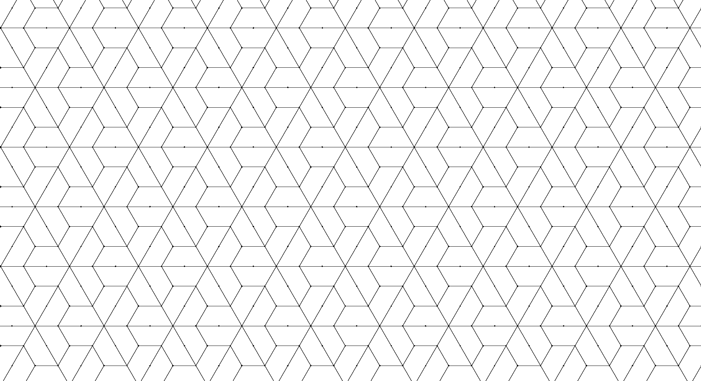

While the grid appears oriented there is only one symmetrical solution (a
mirror = 180º rotation).

Looking at the unit parallelogram, the largest feature are the two triangles
which are **mirrors** of each other.


For encoding purposes let us name the left triangle `V` (Latin Vee V), and the
right triangle `Λ` (Greek Lambda Λ).
Being mirrors these names have some sort of intuitive sense - the "VΛ"
orientation as shown in the parallelogram unit
was chosen just because hotel lifts (US-english: elevators) normally have the '
down' arrow on the left, and the 'up'
arrow on the right.

Within each of these triangles is a triad of half-hexagons.
They inherit their triangular name as an attribute of their identity. As
depicted, the three half-hexagons on the left
are attributed `V`, while the three half-hexagons on the right are
attributed `Λ`. We will call this
the `mode` of the half-hexagon. It can be seen at this point that *
*every hexagon in the grid consists of
one `V` and one `Λ` half-hexagon**.


One can also see that every edge of a `V` neighbours a `Λ`.
This division into is `V` and `Λ` helps us to identify the three orientations to
the hexagon. The hexagon is 'patterned'
by the half-hexagon line.

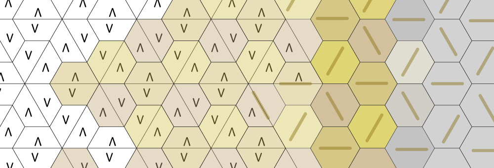

Uncoloured, the 'patterned' hexagon grid is identical to the half-hexagon grid -
it's just that the long line of the
constituent half-hexagon is now considered to be the hexagon's pattern. So,
while an un-patterned hexagonal grid belongs
to the wallpaper group `p6`, the patterned `H9` hexagonal grid is an instance of
the `p31m` group.

Back to the main purpose, we are interested in establishing a hexagonal grid
identity - so we want to be able to
enumerate the hexagons in manner that is directly related to how it is
generated.

Grünbaum/Shephard 1986 establish that for `p31m` there are exactly two periodic
colourings using three colours. It's not
too hard to see that there are only two possible tilings of three colours as
depicted below.

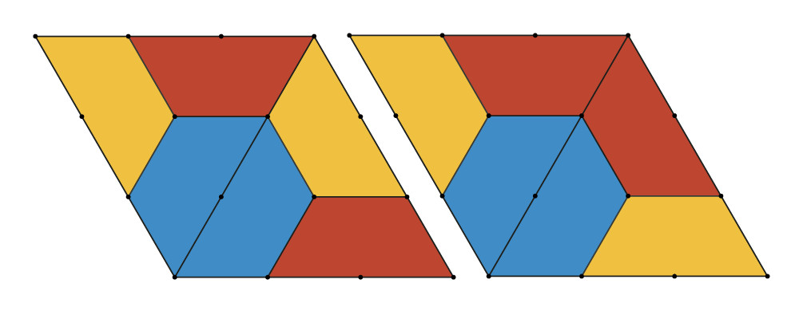

*<small>The two periodic colourings of `p31m`</small>*

'Colouring' here is not constrained (as is found in much of this area of
mathematics, like the four-colour theory) to
adjacent tiles being differently tiled: It's just a permutational constraint.
Also, remember here that we are colouring
the hexagons, **not** the half-hexagons.

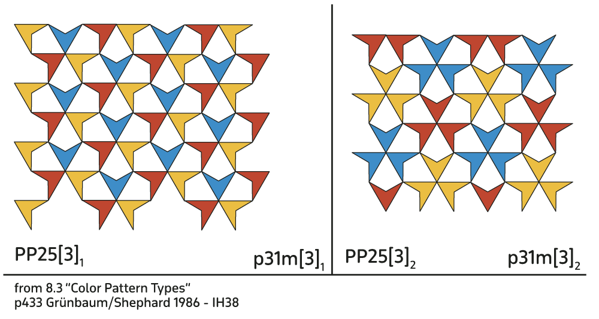

*<small>Grünbaum/Shephard colourings of `p31m`</small>*

If we overlay the hexagons and colour them accordingly..

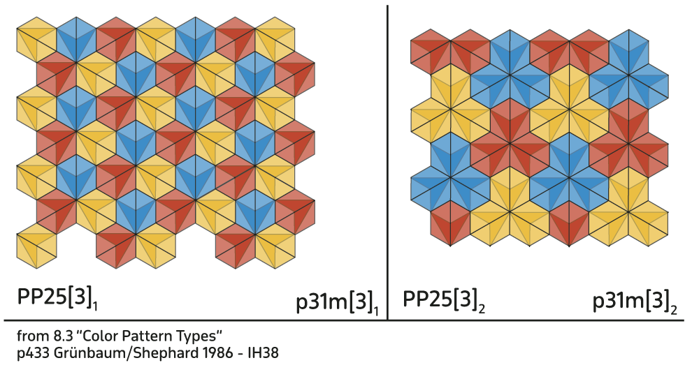

*<small>Grünbaum/Shephard colourings of `p31m` overlaid with `H9`</small>*

While Grünbaum/Shephard name the variations as <code>p31m[3]<sub>1</sub></code>
and <code>p31m[3]<sub>2</sub></code> we
can choose to be parsimonious and call them `C1` and `C2` respectively.

Note that colouring `C1` is already familiar to us - it is equivalent to the
orientation of half-hexagon line as seen on
the 'patterned hexagon'.

However `C2` creates oriented clusters of three-hexagon 'super-tiles', the
members of which have a different
orientation. None of this is surprising - it is merely an effect of the
permutations in this symmetry.

Given we have two colourings `C1` and `C2` (along with the triangle identities)
we can use these aspects of the `p31m`
symmetry to enumerate the grid.

In general numbering colourings is arbitrary - so we want to look at the
features of the hexagons that share the same
colours, and see if we can identify some sort of order – from which we can
determine a number.

Given that the child grid hexagons are one ninth the area of their parent we
should be expecting a base 9 value for each
hexagon. As there are also two colourings of three colours to the grid, we
should expect one to give us the upper trit,
and the other to give us the lower trit of the two digit base 3 equivalent.

We can visualise this use a blue component colouring for `C1` and a red
component colouring for `C2` and overlay them
using an RGB additive overlay.

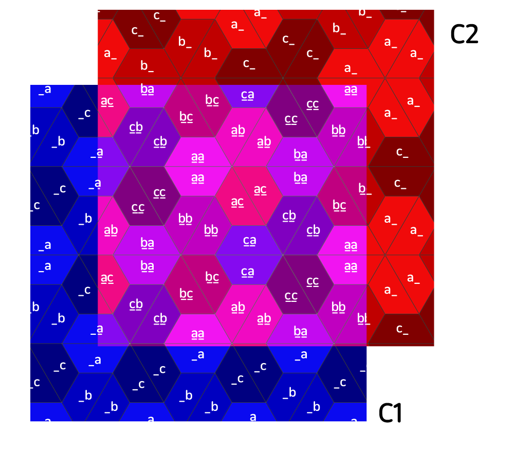

*<small>RGB overlay of `p31m` colourings `C1` and `C2`</small>*

`C2`, the colouring of which clusters hexagons, is intuitively centred on a
cluster.

Permutations over the two colourings entail six different numbering schemes –
while any of them would suffice, it is
always useful to find an approach that is intuitive.

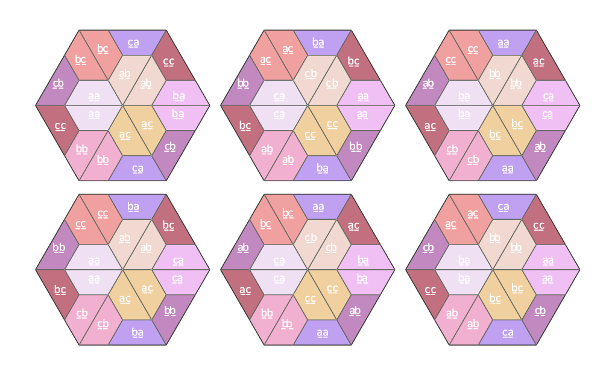

*<small>Six permutations of the `p31m` colourings `C1` and `C2`</small>*

#### Enumeration of `C2`

For `C2`, the hexagons (when overlaid into a parent hexagon) can be seen to have
an order regarding their closeness to  the centre: The three triangles from 
the three hexagon centres - from which,
having ordered them, we can number them
0,1,2

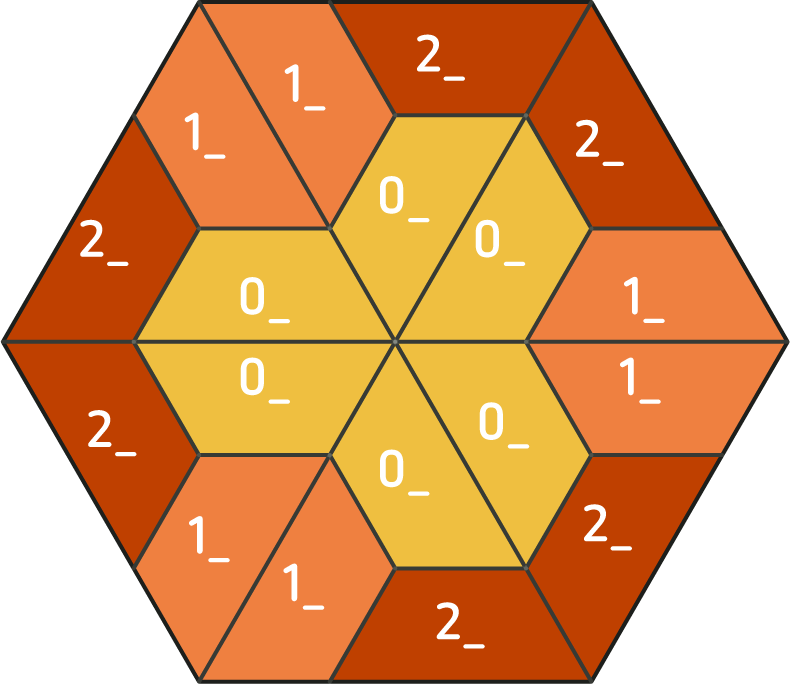

*<small>`C2` numbered by centrality.</small>*

#### Enumeration of `C1`

There are three orientations of the hexagonal 'pattern' (the line that divides
the two half-hexagons that compose it).

These orientations could be labelled 'flat', 'forward', 'back' using
shorthand  '—', '/', '\' respectively. Unlike the
enumeration of `C2`, there is no particular rationale to order these as shown
below, as any one could be the first, and
the ordering could be either clockwise or counter-clockwise any loss of meaning.

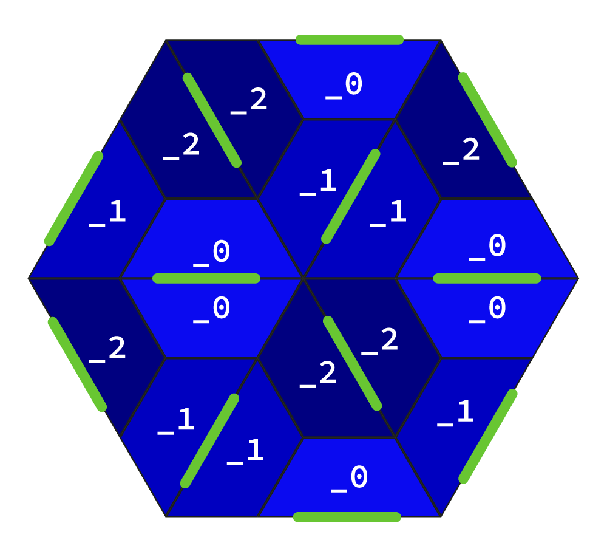

*<small>The orientations coloured by `C1`</small>*

#### Combining `C1` and `C2`

It is possibly of note that `C2` appears to be related to radial distance
while `C1`appears to be related to rotation.

If we number each of the colourings for both `C1` and `C2`, and overlay them, we
will see that every one of the nine
permutations of `C1` and `C2` are uniquely identified, as implied in the RGB
overlay shown earlier.

This gives us, albeit in base 3, an identity of each sub-hexagon under its
parent, from `0` to `8`.

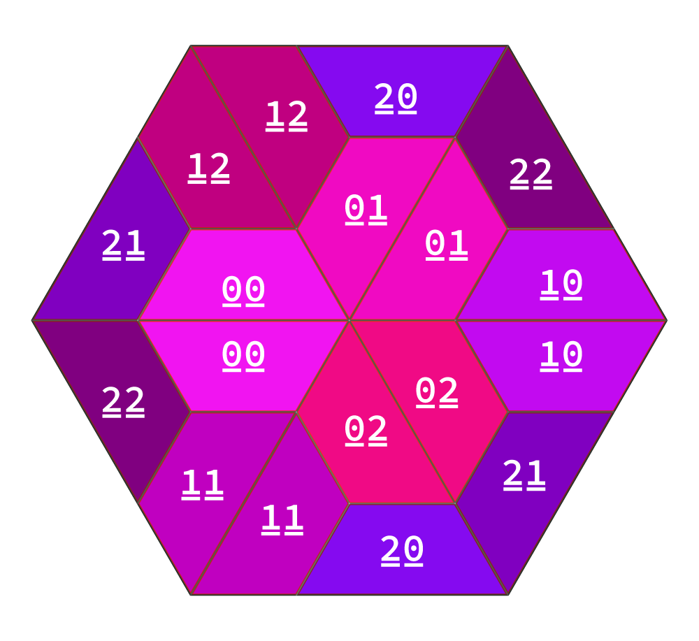

*<small>The orientations coloured by `C1` and `C2` combined.</small>*

#### Half-hexagon enumeration.

Earlier on we defined the 'mode' of each child half-hexagon.
By using these, and knowing that each hexagon is composed of one of each, we can
enumerate the half-hexagons.

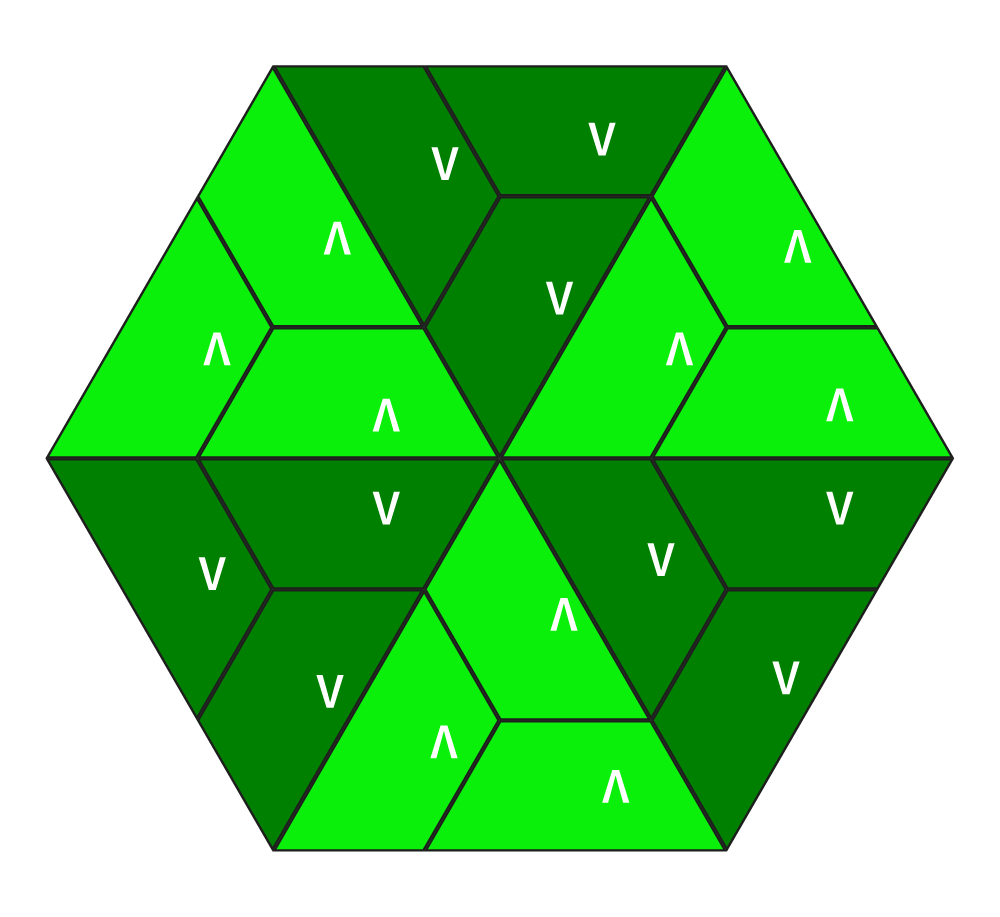

*<small>The triangle identities marked with names.</small>*

We can now use those to identify and enumerate the half-hexagons. This will be
useful for dealing with the 'orphan'
hexagons `20`, `21`, `22`.

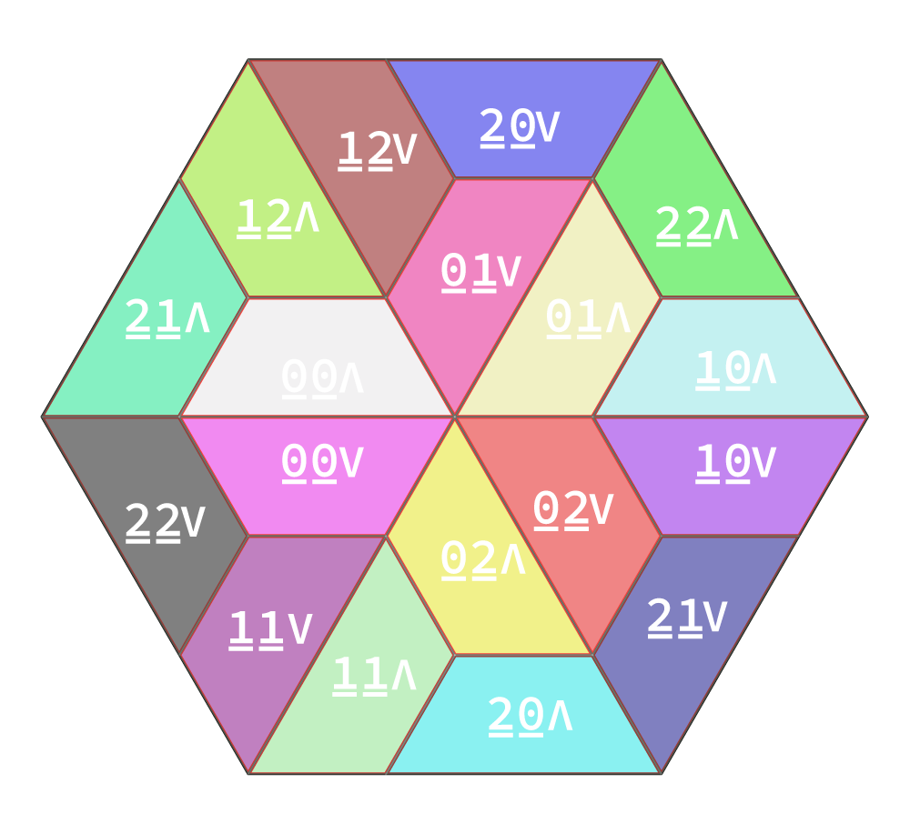

*<small>The half-hexagon enumerations in base3.</small>*

Converting the base 3 digits might obscure their derivation, but it gives us a
single digit base 9 identity for each
hexagonal child.

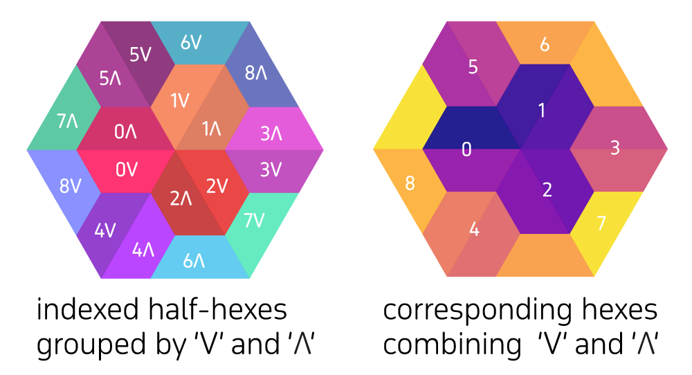

*<small>Base 9 enumeration.</small>*

This concludes the task of enumerating hexagon children of a parent.

### Enumeration in planar hierarchical grids.

While there are numerous ways to represent a grid (including purely nominal
systems like those used by what3words), the
choice of enumeration typically depends on the intended purpose.

For example, a nominal grid uniquely identifies a specific area and is easy to
communicate, but it lacks information
about regional characteristics or relational identities.

Other types of grids include sector-oriented grids and distance-oriented grids,
both of which serve different purposes.

In general, sector-oriented maps, (which often focus on density, regionality,
growth, spread, availability, and other
related concepts), are suitable candidates for hierarchical grids. Conversely,
maps that involve directed travel are
better suited for ordinal grids.

Hierarchical grids are most commonly focused on the same considerations used
with sector-oriented systems, and the
enumeration is best when it helps identify a location based on the hierarchy of
sectors it belongs to.

### Enumerating the planar H9 grid.

Once we recognise the unique enumeration of the space of a hexagon (in this case
in accordance with one of hexagons or
half-hexagons that compose it) we can use a parental hierarchy to uniquely
identify a point on the grid.

A concern arises — when we have two adjacent parents, there will be one hexagon
shared between them, composed of the
two 'orphan' hexagons `6`, `7`, `8` on each side. This can be illustrated with
three adjacent hexagons `a, b, c`.

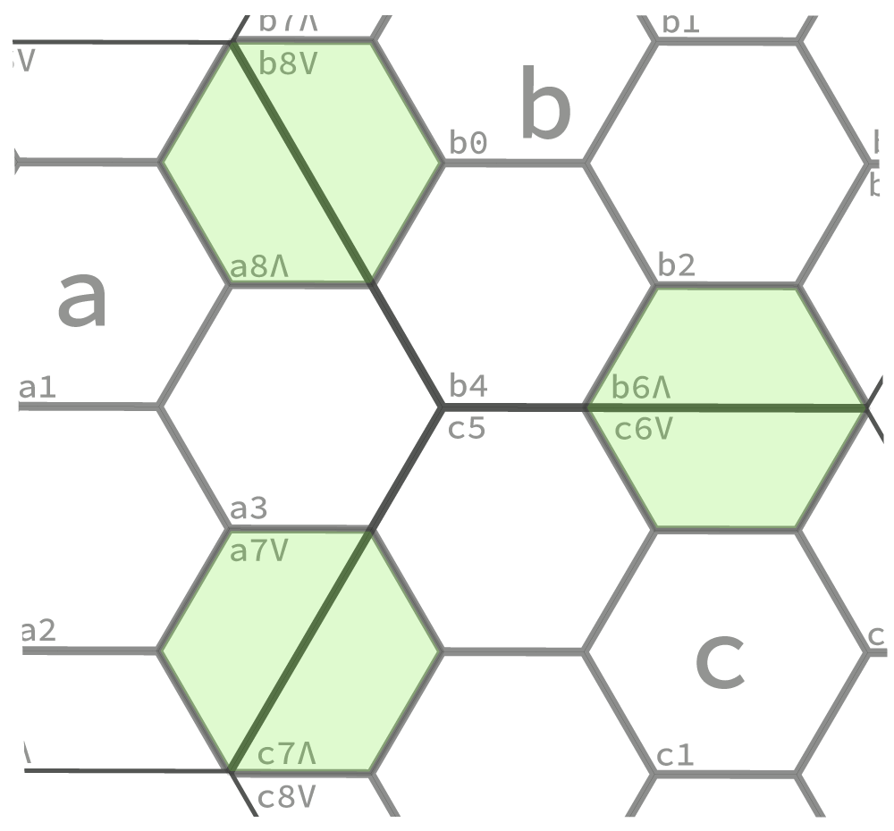

*<small>Orphan hexagons 6,7,8 marked in green</small>*

While there is no doubt about base number of each hexagon, it shares two
addresses - one from each half-hexagon.

Assuming that we use the parent hexagon as a prefix of the current address, we
can see that the '7' hexagon depicted
above has the two unique addresses `a7V` and `c7Λ`. Given that `a` and `c` are
themselves unique, we have a surfeit of
addresses in this case.

#### The `VΛ` convention.

While the two half-hexagon addresses are still informative, and will share
meaning when subdividing this hexagon, we
should hope for a 1-to-1 mapping.
A trivial approach here is to use an order of precedence for the triangle
identities `V` and `Λ`. The choice of
precedence is arbitrary, so we choose `V` over `Λ` as a convention, and name it
the "`VΛ` convention" (pronounced "
V-Lambda ", or "down before up" convention). We can now address the subgrid
uniquely, while maintaining the `V` and `Λ`
for edges.

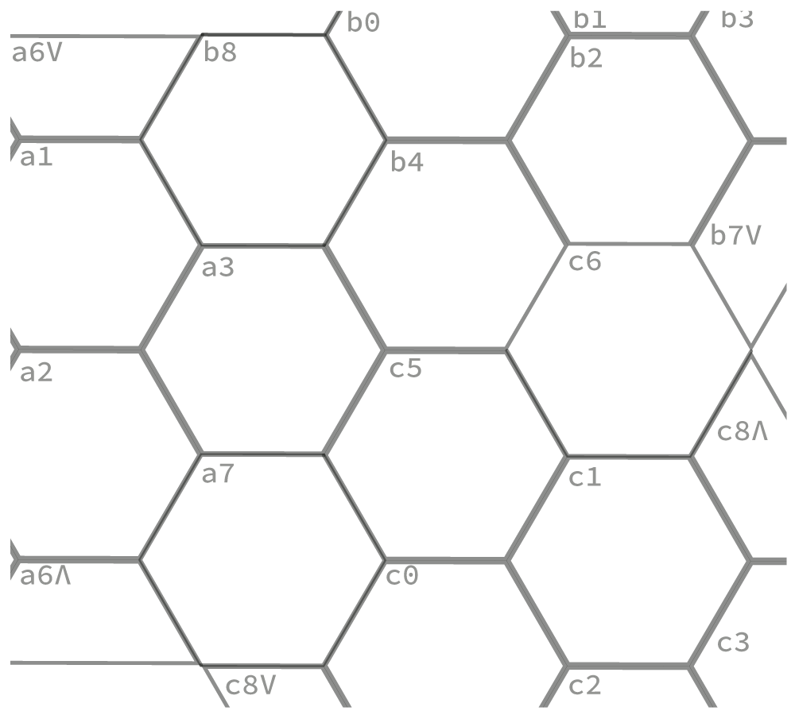

*<small>Orphan hexagons resolved following `VΛ` convention.</small>*

#### Origin

While any origin is arbitrary let's consider the two primary topologies that
concern hierarchic grids: The plane and the
surface of a spheroid (or sphere).

We will assume a rule-of-thumb that we only need to include those points which
are within context.

##### Origin on the plane

We can define a hexagon such that its position and dimension can be chosen such
that it includes every point in context.

This is defined as the origin hexagon. Its address is `0`. If, at some future
point, it is not large enough, we can
subtend it within a parent (or parental generations) as long as we revise its
address (and those of its descendants)
accordingly.

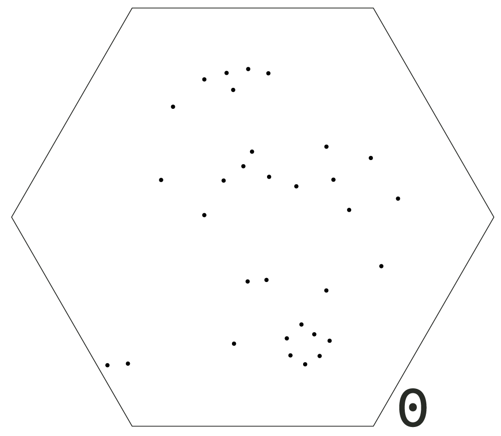

*<small>Origin Hexagon with points of interest</small>*

At this level of accuracy, every point of interest belongs to the same
address: `0`.

----
Following the aforementioned enumeration scheme we can improve the accuracy one
generation at a time, at each time
prefixing the parent hexagon onto the address.
Because the hexagons 6-8 are split and on the edges we must include the triangle
identity for those.
Fortunately the orientations of these are always the same - e.g,  `6V` is a '
boat' (with long edge up), while `6Λ` is
an 'umbrella' with long edge down.

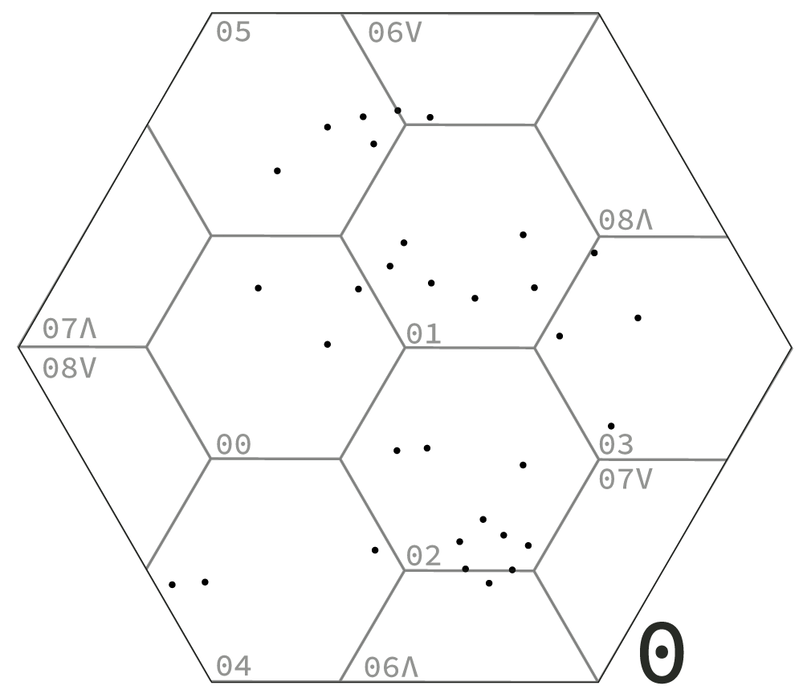

*<small>Hexagons 00 with points of interest</small>*

At this accuracy there are nine points that share address 02.

#### Origin address redundancy

It should be now clear that, while the origin hexagon (on the plane) contains
the entire context, the leading zero can
be left implicit.

----
We can indefinitely continue to improve the accuracy one generation at a time at
each level prefixing the parent hexagon
onto the address.

Whenever we depict a half-hexagon on the edges of the grid we must include the
mode for those. For all
other 'whole' hexagons we use the `VΛ` convention. This might seem
counter-intuitive at first, but all 'whole' hexagons
will always have a unique position. Take, for example, the case where one is
examining a subregion of `6V`: It's
composite children differ from `6Λ` except for when the two are conjoined.
Therefore it is unnecessary to record the
mode for whole hexagons.

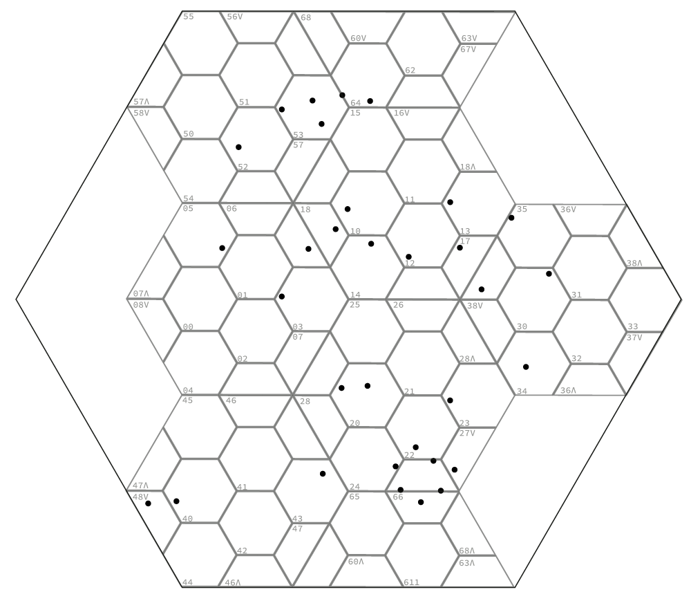

*<small>Subgrid with fewer points of interest per hexagon.</small>*

While this last image shows the outline of the parent grid it is trivial to
remove it.

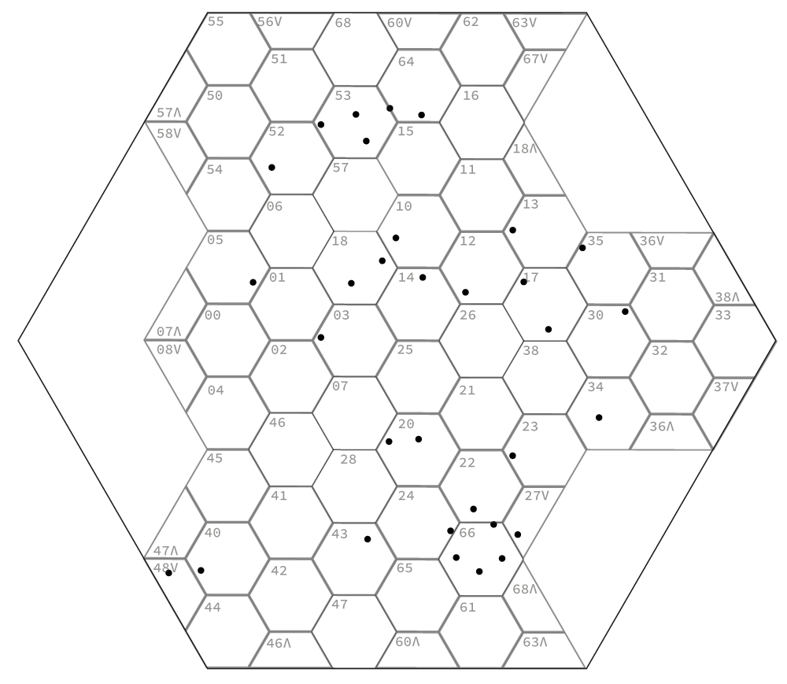

*<small>Subgrid with fewer points of interest per hexagon - no parent grid
showing.</small>*

#### Further refinement to the `VΛ` convention.

When addressing children of orphans, addressing must follow the orphan address,
not the `VΛ` convention address: In
other words the `VΛ` convention relates only to the unique address of a hexagon
at any given level of the hierarchy, and
not to its offspring.

In the example being displayed most points now have a unique address - except at
hexagons `53` and `66`. Because this is
latter hexagon is an orphan within an orphan, it is possibly of value to examine
a further subdivision of it so that we
can demonstrate this refinement of the `VΛ` convention.

Recall that the two component addresses for `66` are `66V` and `26Λ`. (We can
always derive the two orphan addresses
from a `VΛ` convention address. In this particular case, we have the `66V`
orphan of half-hexagon `6`, and the `26Λ`
orphan of `2`).

In the following figure it is apparent that the nine child addresses: those
which are either whole hexagons or hold
the `V` mode are entirely governed by the parent half-hexagon,
while the `Λ` addresses are handled by its
neighbours (unless at the edge of the grid).

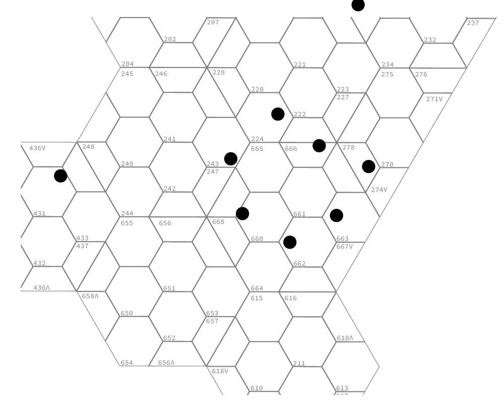

*<small>Subgrid with fewer points of interest per hexagon - no parent grid
showing.</small>*

At this point it is possible to identify all the sample point addresses
uniquely. If further precision is required one
may follow the same steps recursively.

We now have defined a method for deriving a unique address for any point on the
plane.

## Address conversion

An important function, especially when dealing with heterogenous data sources,
is to develop functions that readily allow for lossless conversion from 
other address systems. For the Euclidean plane, we would a function that 
converts (x,y) to an H9 address, as well as it's inverse.

### H9 Planar Address Algorithm

The approach is based on an equilateral triangle with a side length of √2, and
the origin at its barycenter.
Any points outside this triangle will be rejected as out-of-scope.
We need two inputs:

1. The xy coordinate pair, and
2. The *intersection identity*.

Recollecting `C1`/`C2` enumeration,


The *intersection identity* (loc) is indicated by the `C2` (high trit) 
components of the three hexagons that the triangle
holds a half of each, following `C1` (low trit) order.

* `021`, `102`, `210` indicate `Λ`
* `012`, `120`, `201` indicate `V`

*(Here C1 addresses are marked with their mode in order to
signify them)*

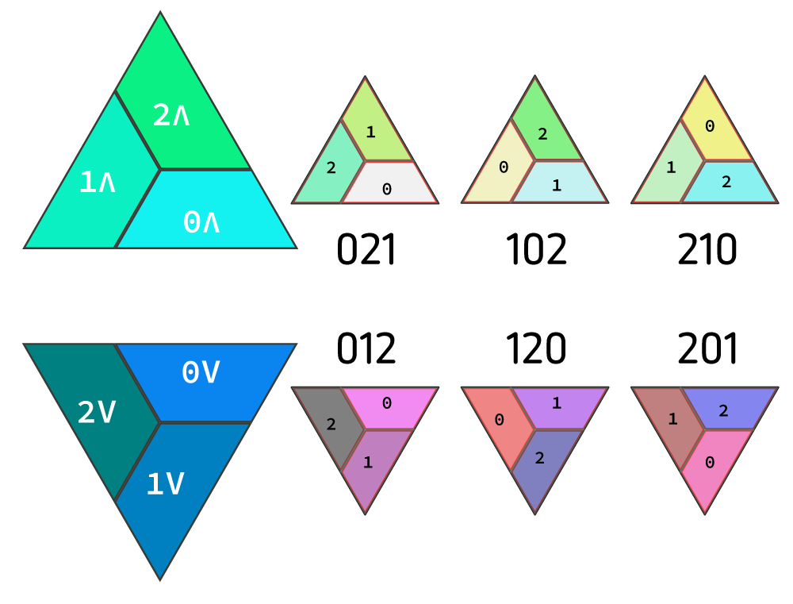

We now require a set of inequalities that will determine where the point is.

#### Symbolic Definitions

*Because we are working on equilateral triangles, most of our inequalities will
involve `√3`.*

* `w` The side length is a synonym for `√2`
* `h` The derived triangle height is `√6/2`
* `ẋ` is a synonym for `√3(x)` (where `x,y` are the input coordinates)
* `ẇ` is a synonym for `w(√3/3)` (used for x offsets)

#### Scope test

It is important to verify that the point is **in scope** - i.e., it lies within
the triangle.

##### `Λ` triangle (`021`, `102`, `210`)

Using

* `c` (ceiling - max. `y`) as a synonym for `2h/3`
* `f` (floor - min. `y`) as a synonym for `-h/3`

The point is **in scope** (within the triangle) if it satisfies

`f < y ≤ c-|ẋ|`

##### `V` triangle (`012`, `120`, `201`)

Using

* `c` (ceiling - max. `y`) as a synonym for `h/3`
* `f` (floor - min. `y`) as a synonym for `-2h/3`

The point is **in scope** (within the triangle) if it satisfies

`f+|ẋ| < y ≤ c`

#### Identifying the C1 address

Points out of scope are **rejected**.  
We now identify which of the three half-hexagon sectors the point lies in, which
identify the `C1` sector.

###### `Λ` triangle C1 identity

* When `y < 0` and `y ≤ ẋ` then the point is in`0Λ`
* When `y ≤ -ẋ` and `y > ẋ` then the point is in`1Λ`
* When `y ≥ 0` and `y > -ẋ` then the point is in`2Λ`

###### `V` triangle C1 identity

* When `y ≥ 0` and `y > -ẋ` then the point is in`0V`
* When `y ≤ ẋ` and `y < 0` then the point is in`1V`
* When `y ≤ -ẋ` and `y > ẋ` then the point is in`2V`

#### Hexagon Identity

Using the passed `C2` parameter (as a 3 digit tuple) we can now identify the
hexagon.

```python
c1 = 1  # identified C1 `1Λ`
c2 = 0, 2, 1  # intersection identity parameter 
hx = c2[c1] * 3 + c1  # hex number (7)
```

#### Identification of **child** `C2`

While this has provided us with the hexagon region for the current layer we
normally want the full address, and so we
need the next `C2` value.
Each `C1` region may be further divided into three triangles identified by their
*intersection identities*.  
These are easier to identify with the following diagram, while recognising the
C0 orientation.

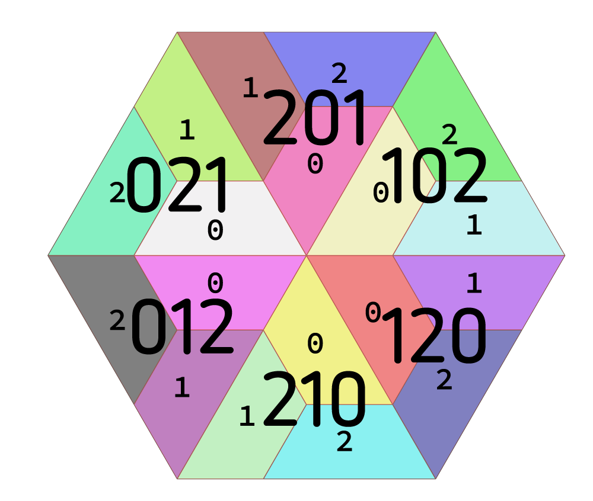

##### `Λ` Identification of **child** `C2`

For points in `0Λ` (flat),

* `y ≤ -ẋ` identifies `021`
* `y < -ẋ` and `y > ẋ - ẇ` identifies `201`
* `y ≤ ẋ - ẇ` identifies `102`

For points in `1Λ` (forward),

* `y ≥ 0` identifies `102`
* `y < 0` and `y > -ẋ-ẇ` identifies `120`
* `y ≤ -ẋ-ẇ` identifies `210`

For points in `2Λ` (back),

* `y ≤ ẋ` identifies `210`
* `y > ẋ` and `y < h/3` identifies `012`
* `y ≥ h/3` identifies `021`

##### `V` Identification of **child** `C2`

For points in `0V` (flat),

* `y ≥ ẋ` identifies `012`
* `y < ẋ` and `y < ẇ-ẋ` identifies `210`
* `y ≥ ẇ-ẋ` identifies `120`

For points in `1V` (forward),

* `y ≥ -ẋ` identifies `201`
* `y > -h/3` and `y < -ẋ` identifies `021`
* `y ≤ -h/3` identifies `012`

For points in `2V` (back),

* `y ≤ 0` identifies `120`
* `y > 0` and `y < ẇ+ẋ` identifies `102`
* `y ≥ ẇ+ẋ` identifies `201`

#### Offset coordinates

We then offset the original coordinates to centre the identified triangle for
the next iteration,
we calculate `(x’, y’)` using the offset in accordance with `C1` and **child
** `C2`:
*where `u` := `w/6`, `v` := `h/9`*

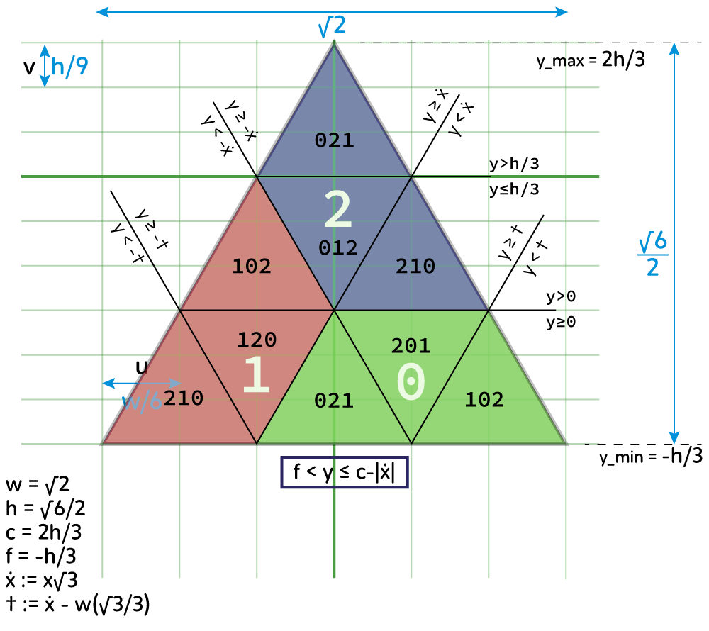

* `0Λ.021` : x, y+2v
* `0Λ.201` : x-1u, y+1v
* `0Λ.102` : x-2u, y+2v
* `1Λ.102` : x+1u, y-1v
* `1Λ.120` : x+1u, y+1v
* `1Λ.210` : x+2u, y+2v
* `2Λ.210` : x-1u, y-1v
* `2Λ.012` : x, y-2v
* `2Λ.021` : x, y-4v

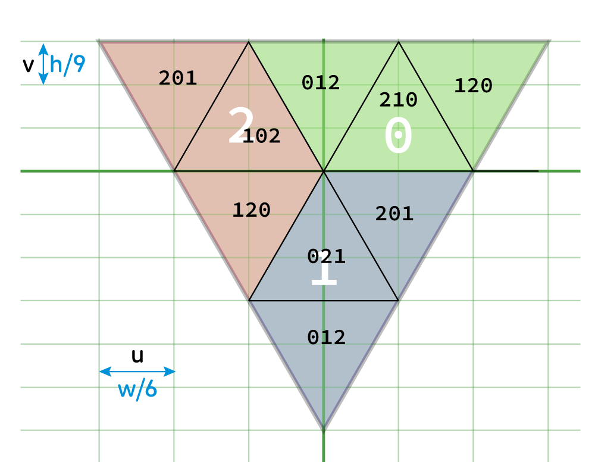

* `0V.012` : x, y-2v
* `0V.210` : x-1u, y-1v
* `0V.120` : x-2u, y-2v
* `1V.201` : x-1u, y+1v
* `1V.021` : x, y+2v
* `1V.012` : x, y+4v
* `2V.120` : x+1u, y+1v
* `2V.102` : x+1u, y-1v
* `2V.201` : x+2u, y-2v

#### Scaling coordinates and re-iteration

We now multiply both `(x’, y’)` by 3 and are ready for the next iteration,
storing the
identified hex, and passing `(x’, y’)` and **child** `C2`.

We might continue to do this until we start seeing numerical errors which, for
64 bit machines, happens after about 30 iterations.
The algorithm is fast: It depends solely on inequalities and one multiplication
of the x coordinate with √3 per
iteration.

##### Example

Given the point `(0.2924332269536584, 0.28114591390120613)` and initial `C2`
of `021` the algorithm returns `520352116102665517712277467235V`.
If the length of one side of initial triangle were 1000km, this address 
identifies a region less than 1 attometer^2 - so any errors will 
be arising via projections, not from the address translations.

#### Unravelling H9 addresses

While an H9 address is compact, it is often useful to have the `VΛ` values at
each stage, as this helps to identify
which particular half-hexagon to follow - this is most relevant when dealing
with the orphan hexagons 6,7,8.
This is best done in reverse, as we can avoid the use of a stack when resolving
apparent ambiguities.
Given the `VΛ` convention we can assume that the final region is `V` if it is
undefined.

#### Unravelling algorithm

This works by recognising that there is a strong relationship between parent and
child, and that the child's triangle
identity
uniquely identifies the parent's mode.  
For example, consider the half-hexagon `6V`.
If it belongs to a parent `6` hexagon, that parent half-hexagon must be `6Λ`.
Whereas for half-hexagon `0V`, if it belongs to parent `0`, that parent
half-hexagon must be `0V`.
There are four cases - where the parent identity is strongly fixed (for example
a child `2` of parent `0` only occurs
when `0` is `0V`)

```python
def unravel(par, curr, t_id):
    # C2 can be seen as distance from Centre (0,1,2)
    # C1 can be seen as orientation (–,/,\ for 0,1,2 respectively).
    # Given a parent/child address (with child half-hex VΛ) we calculate the
    # parental half-hex identity. EG, for par=3, curr=5, t_id='V', return 'Λ'
    lut = [t_id, 'V', 'Λ', 'Λ' if t_id == 'V' else 'V']
    c2, c1 = divmod(curr, 3)  # unpack base 3 values.
    p_c1 = par % 3  # we only use the c1 value of parent.
    if c2 != 1:
        idx = (p_c1 - c1) % 3
    else:
        idx = (c1 - p_c1) % 3
    return lut[idx] if c2 != 2 else lut[3] if idx == 0 else lut[0]
```

##### Example

Given the address `520352116102665517712277467235V`,
it is unravelled
to `5Λ2Λ0Λ3Λ5V2V1Λ1Λ6Λ1V0V2V6V6Λ5V5V1Λ7V7Λ1Λ2V2V7V7Λ4Λ6Λ7Λ2V3Λ5V`
It is trivial to *ravel* the address merely by removing the triangle identities.

#### Inverse Operation.

Given the address `520352116102665517712277467235V` it is easy enough to derive
it's XY coordinate pair
`(0.2924332269536584, 0.28114591390120613)` by unravelling the address and
reversing the conversion process.

## Tiling the Octahedron.
Now we turn to the Octahedron - this will be the underlying representation of 
the sphere, via some form of projection.

Especially on the spheroid the natural origin is the axis of rotation. As
mentioned above, the icosahedron projection is  not so useful due to the 
fact that there are five edges meeting each vertex -
and the reflective nature of `p31m`
requires and even number of edges to meet at each vertex. This nature, as
suggested earlier, lends itself very well to  a `pyritohedral symmetry` 
following the structure of a pole-aligned octahedron. However, while `p31m` and 
`Th` (pyritohedral symmetry) share similarities, they are not the same, and 
we must address that. 

One can see via the following image that the basic scheme works fine.
The challenge, however is easily identified once one attempts to enumerate 
each hexagon below the root layer of the hierarchy.


Using a planar tiling across an octahedral net appears to be consistent, 
until one folds the octahedron. The following image has a bar coloured to 
assist in showing how the net folds to an octahedron. 

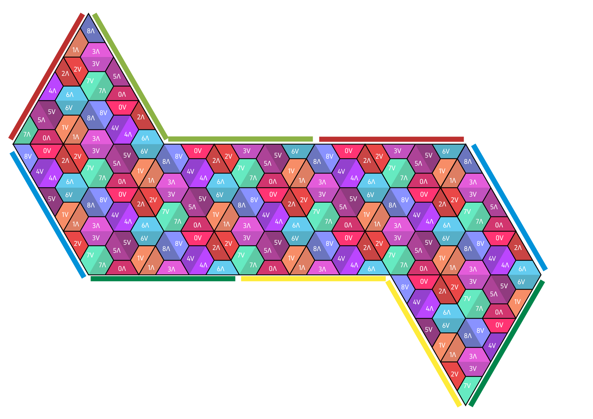

When we look at the joining edges, we can see that 4 or 5 of the joined edges 
will not be numbered correctly, regardless of the net that we choose.

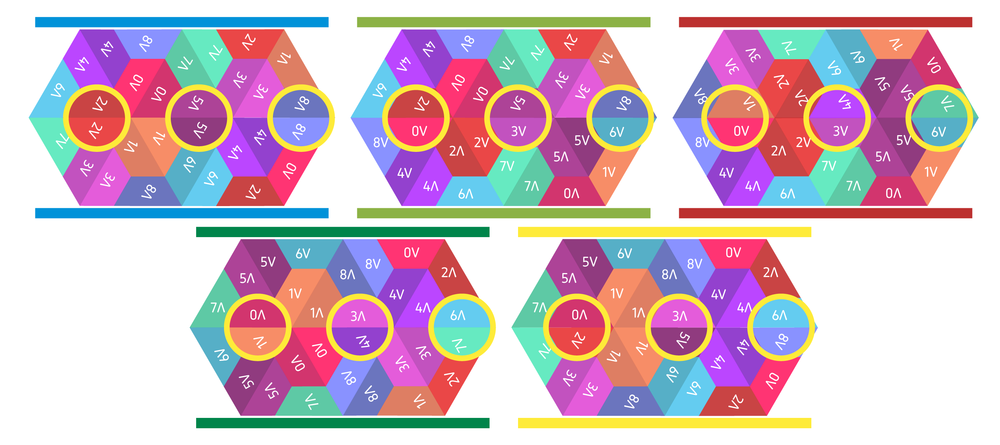

What is encouraging is that the C2 (MSB) enumeration is working okay, 
but the C1 (LSB) is mismatching. This isn't so surprising, considering C1 
depends upon orientation in 2D, and whenever we fold a net some of those edges 
will be rotated: The mis-matched values indicate the changes in 
orientation, which is what we should expect to see following the definition 
of C1.  

However, for the purposes of enumeration, this is not what we want to see. 
Moreover, we want to have a consistent system of enumeration regardless of 
the level of the hierarchy above zero.  (The 0 hierarchy of the octahedron 
can be suitably addressed on a per-face basis, and so we may as well use the C2 
values for each).  We should be able to hold onto the 'VΛ' values, as they 
effectively represent a mirror operation that remains unchanged under `Th` symmetry.

Needless to say, the internal edges are still consistent as are any edges 
which wrap around - thereby sharing the same orientation on both sides, but 
it does not seem appropriate to use special cases for these edges.  We need 
to adopt an alternative to the C1 scheme without losing subset enumeration.

In order to maintain nine separate addresses for each sub-hexagon, we must  
find a means of sharing edge values along boundaries that may change in 
orientation. 

Following is one of several solutions to the conundrum. Here we take the 
planar C1 and rotate 3 of the outer (c2=2) half-hexagons 120º. We can now 
see that each of the mid (c2=1) hexes 0, 1, 2 are flanked by the same number 
half-hexes (1,2,0 respectively).  

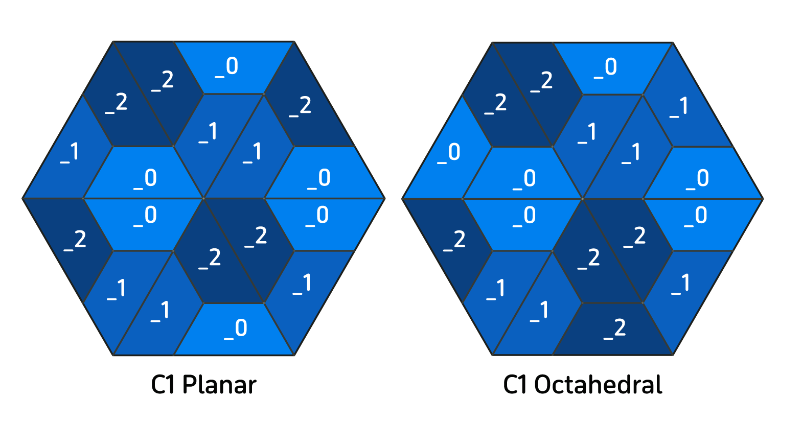

However, this no longer tiles on the  plane at all.  In order to recover 
planar tiling we will need to rotate the C1 octahedral which itself leads 
to 3 orientations of the unit hexagon. The C2 is invariant in this rotation.

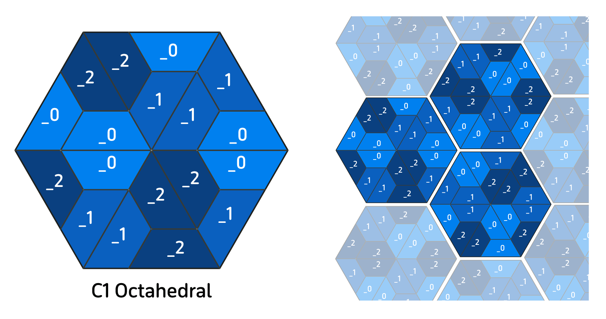

Applying this to the net, carefully, allows for us to maintain integrity of 
enumeration of the hexagons.

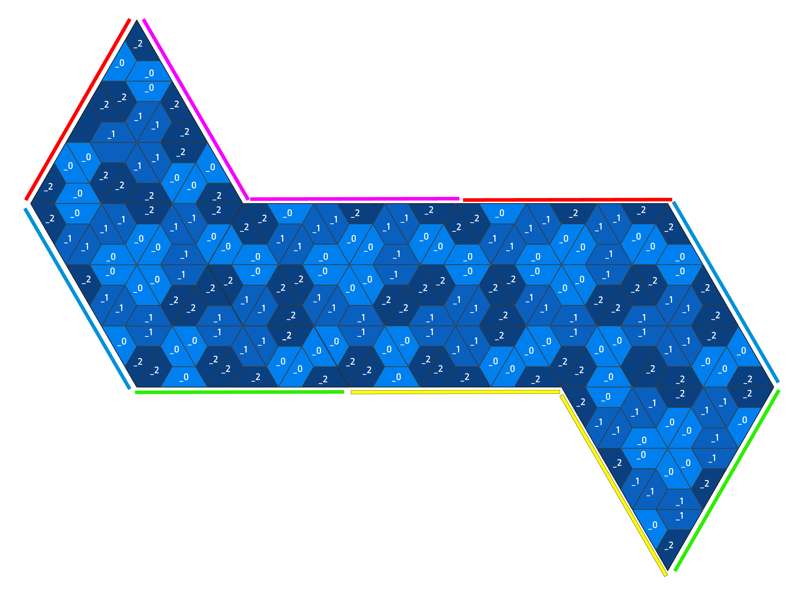

We find that not only do the hexagons now wrap correctly, but the edge sets 
are equivalent to each other.

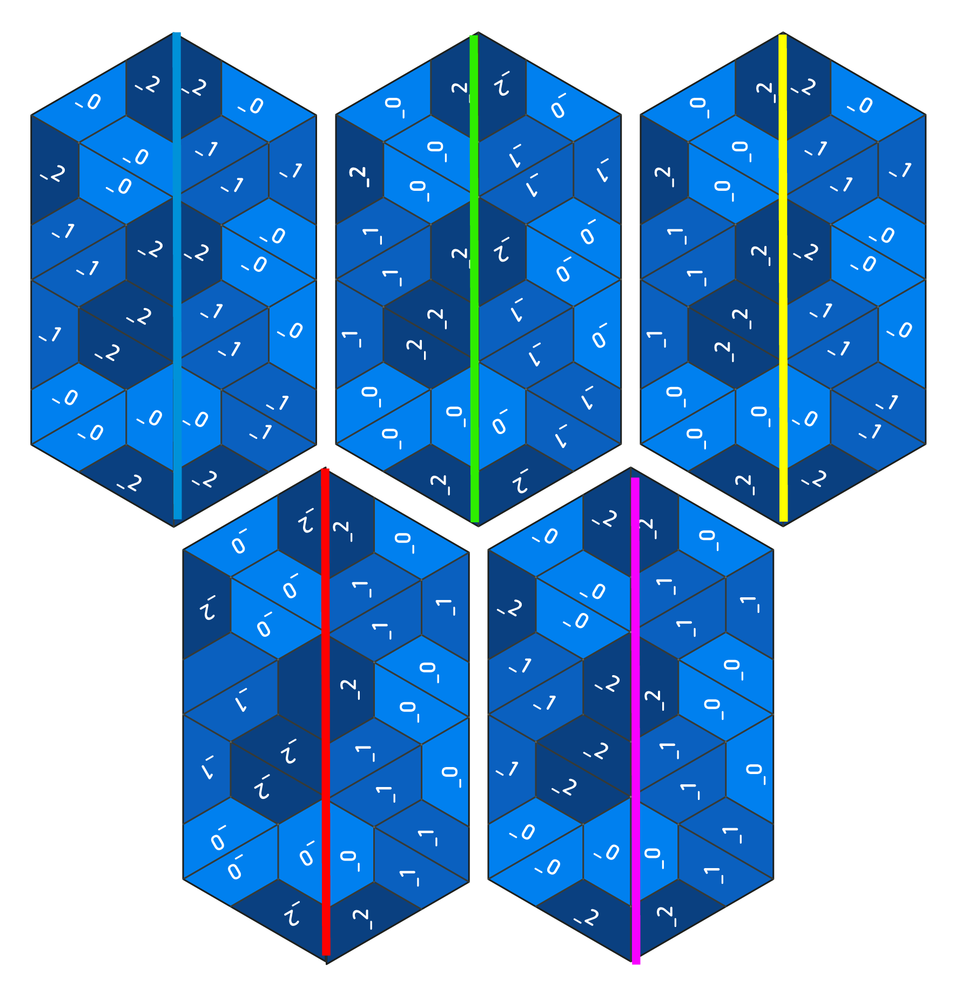

Applying C2 back into the grid yields a good enumeration which now is 
effective at any depth (beyond 0) within the Octahedron.

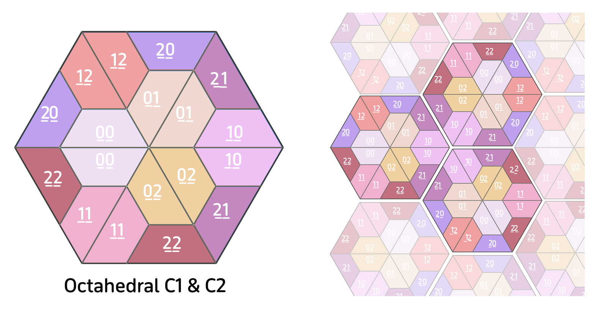

From which we can apply it onto a net. 

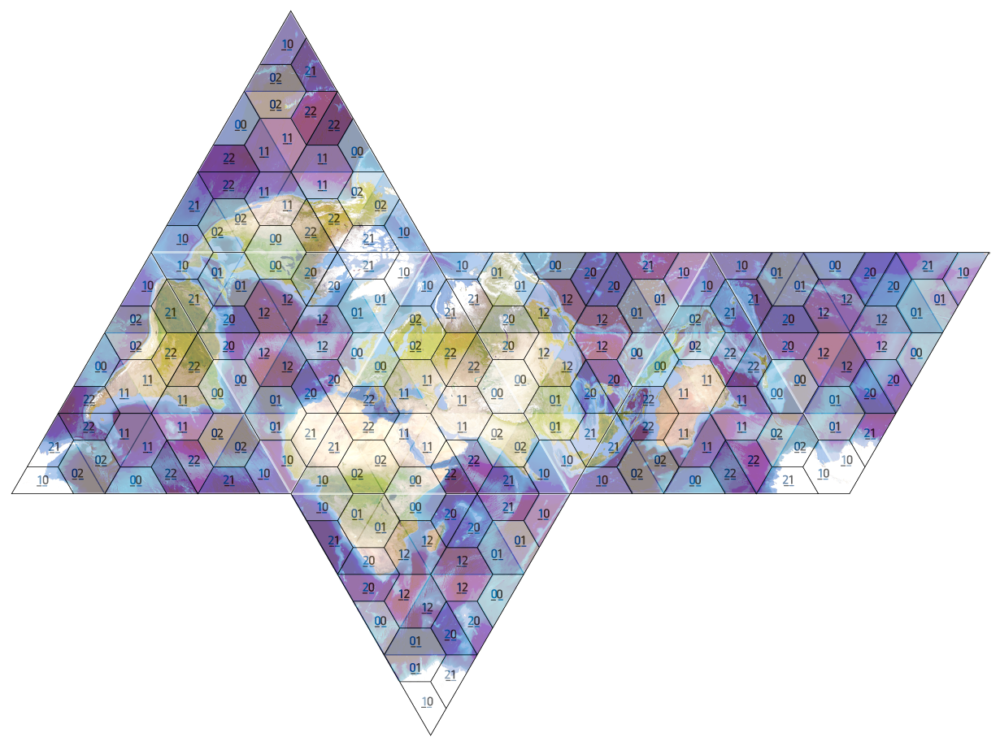


While there are adjacent hexagons with the same identity, these always 
belong to different parent hexagons, so the grid addressing continues to be 
reliable.  We can now enumerate the H9 hierarchic grid across the octahedron.

#### Octahedron Layer 0 
The faces of the octahedron can readily be mapped using little more than 
threefold subdivision. In this case we are fixing the octahedron at the 
poles and the equator (which is normal practice) using the
prime meridian to determine longitudinal vertices. (For his conformal 
projection, Cahill preferred a shift a few degrees along longitude).

Vertices: `NSWEAP`: Two latitudinal vertices and four longitudinal vertices:

**Octahedral Vertex Table**

| Ch | Name         | Where   | GCD | Value | Cartesian |
|----|--------------|---------|-----|-------|-----------|
| N  | **North**    | Pole    | Lat | +90º  | (0,0,+1)  |
| S  | **South**    | Pole    | Lat | -90º  | (0,0,-1)  |
| E  | **East**     | Equator | Lon | +90º  | (0,+1,0)  |
| W  | **West**     | Equator | Lon | -90º  | (0,-1,0)  |
| A  | **Atlantic** | Equator | Lon | +0º   | (+1,0,0)  |
| P  | **Pacific**  | Equator | Lon | +180º | (-1,0,0)  |

It's useful to recognise that the naming scheme (and corresponding vertex 
list) is in reverse order to the cartesian coordinates (XYZ).
The octant sign list in the table provides us with an easy 
correlation between the unit sphere/spheroid and the unit octahedron 
coordinates: Just the signs of the coordinates of a point determines the 
octant that the point belongs to.  Again, each face will have one `mode` 
assigned to it, in that it either consists of `V` half-hexagons or `Λ` 
half-hexagons.

**Octahedral Face Table**

| Ch  | Name                    |  Octant   |  Mode |
|-----|-------------------------|-----------|-------|
| NEA | North East Atlantic     |  +, +, +  |   V   |
| SEA | South East Atlantic     |  +, +, -  |   Λ   |
| NWA | North West Atlantic     |  +, -, +  |   Λ   |
| SWA | South West Atlantic     |  +, -, -  |   V   |
| NEP | North East Pacific      |  -, +, +  |   Λ   |
| SEP | South East Pacific      |  -, +, -  |   V   |
| NWP | North West Pacific      |  -, -, +  |   V   |
| SWP | South West Pacific      |  -, -, -  |   Λ   |

Edges are named according to their corresponding vertices.
Each divides two faces. Each hexagon is curled around two faces and is split by
one edge; a 1-1 correspondence. We can therefore name each 
hexagon at layer 0 by the edge that divides it. It is relevant to point out that
Hexagons of the octagon may be placed in two manners - for instance, the 
hexagon that is split by the edge defined by `NA` could share a vertex with 
Either `N` or `A`. 

Here we have selected the former, as it 
appears to lend itself better to geographic features; for example Europe is 
entirely contained within the hexagon `NA`. This comes at a cost, however, 
in that it inverts the planar mapping, so we will notice, for example, that 
`V` faces have a vertex pointing North, rather than South as one would expect.

The `C2` values of each hexagon indicate which axis it touches, with `C2:0` 
hexagons being polar (NS), `C2:1` at longitude ±90 (EW), and `C2:2` 
longitudes 0,180 (AP). In general, as with planar, the `C2` address will 
indicate the centrality of the child hexes to the parent hex, with `0` being 
central.  For the purposes of envisaging what is happening at layer `0`, we 
can imagine that the tetrahedral pyramids with their apex at each pole are 
represent the centres of a cut down hexagon.

The R column below indicates the rotation of the child hexagon C1, while C2 
is invariant.
how the C1 values are rotated (at 0º, 120º, 240º relative to the polar(?) axis).

**Octahedral Edge / Hexagon Layer 0 Table**

| Ch | Name              |  Faces    | C2 | R |
|----|-------------------|-----------|----|---|
| NA | North Atlantic    |  NEA, NWA | 0  | 2 |
| SA | South Atlantic    |  SEA, SWA | 0  | 0 |
| NP | North Pacific     |  NEP, NWP | 0  | 0 |
| SP | South Pacific     |  SEP, SWP | 0  | 1 |
| NE | North East        |  NEA, NEP | 1  | 1 |
| NW | North West        |  NWA, NWP | 1  | 0 |
| SE | South East        |  SEA, SEP | 1  | 0 |
| SW | South West        |  SWA, SWP | 1  | 2 |
| EA | East Atlantic     |  NEA, SEA | 2  | 0 |
| WA | West Atlantic     |  NWA, SWA | 2  | 1 |
| EP | East Pacific      |  NEP, SEP | 2  | 2 |
| WP | West Pacific      |  NWP, SWP | 2  | 0 |

While `North East` is more known as the Far East, and `North 
West` is commonly just called the West, the names appear to be quite intuitive.

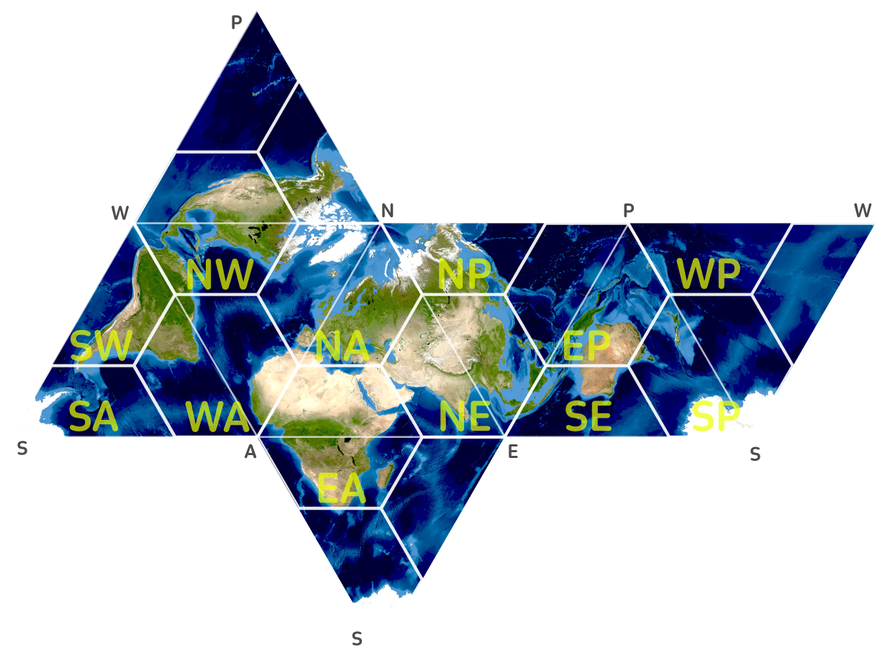

*<small>Labelled Octahedral Projection showing Layer 0 hexagon names.</small>*

As long as the `C2` tiling is applied correctly we can use this value as 
the basis of deriving and expanding each address.  Yet, as there is a 
one-to-one correspondence with each hexagon with it's `C2`, we do not 
need to express it in octahedral addresses - it is defined by the hexagon name.

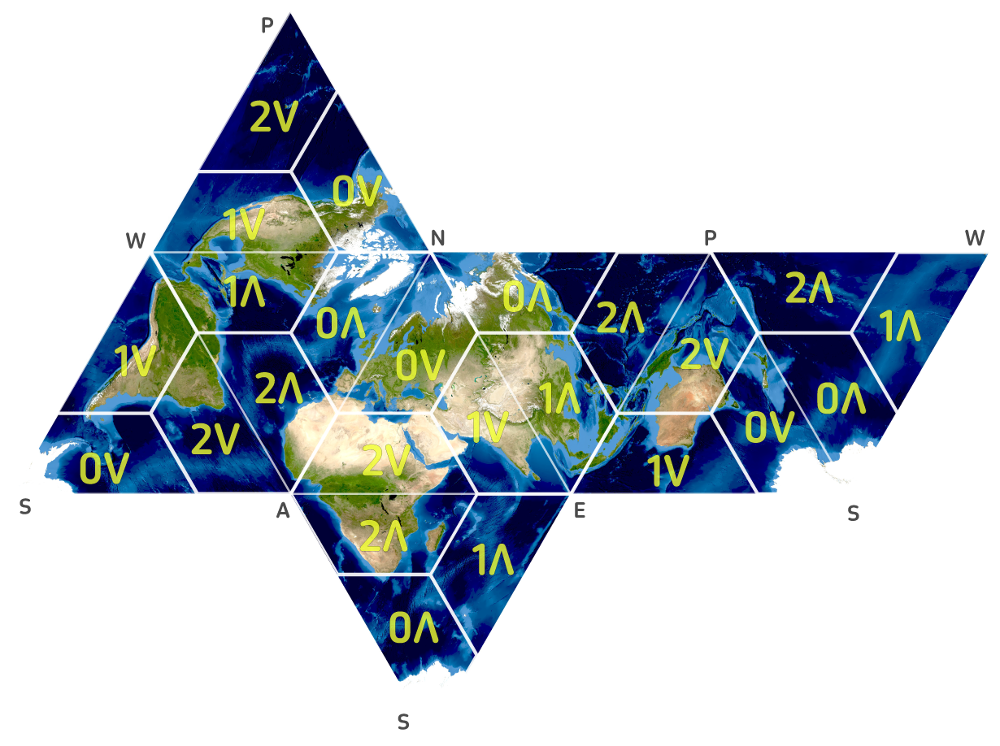

*<small>Labelled Octahedral Projection showing Layer 0 hexagon C2 addresses.
</small>*

#### Conclusion: Address/enumeration of Layer 0.

In this scheme each of the 12 hexagons that cover the sphere are a root of the
grid. While they have good properties of  neighbourhood - they do not have a 
coherent 'parent' grid, and are best related via their neighbourhood. It can be
readily seen that there is no coherent parent: Let's examine the partial hexagon
centred at N, bounded by vertices `PWAEP`. Because the edge NP is 
a single edge, there is no hexagon centred at N on the octahedron; instead 
there is a tetrahedral pyramid.

Nevertheless, choosing a group of 12 hexagons as the basis of the grid has no
significant drawbacks: Indeed, it becomes  quite easy to recognise that EA 
covers Africa, NA covers Europe and the North Atlantic, NW covers most of North
America.  Therefore, this serves well as an origin for geographic and 
spherical mapping.

For addressing purposes, therefore when denoting an address, the governing 
hexagon will prefix the address (e.g., `NW`). Because it is very useful 
to know which octant we are on, we will also include the mode of each 
half-hexagon, (e.g., `NWVxxx`). The first part of the address is likewise 
covered, so we do not need to explicitly express the initial `C2` as a part 
of any addressing scheme, in that NW is correlated implicitly with 0, etc. 

This provides us with a breakdown of the sphere into the 24 well-defined 
half-hexagons of layer zero, such that, for example, California will be 
found in `NWV`, Lisbon in `NAΛ`, Dakar in `WAΛ`, Perth in `SEV`. and so on.

### H9 Octahedral Address Algorithm
#### Inputs and constraints
A 3D point `p` is the sole input required. 

This is
1. The 3D coordinate (x,y,z) such that 
`|x|+|y|+|z|=1` 

#### Octant identification
We identify which octant the point belongs to by examining the 
signs of each coordinate (0 may be considered +ve) The Octahedral Face Table 
above indicates which octant this will be in.

*Example: given address `(0.42534401 -0.01177462  0.56288137)`, the signs 
are `+, -, +` therefore the octant is `NWA`, with mode `Λ`.*

*The related edges/hexagons are*

| Ch | Name              | Faces     | C2 | R |
|----|-------------------|-----------|----|---|
| NA | North Atlantic    | NWA, NEA  | 0  | 2 |
| NW | North West        | NWA, NWP  | 1  | 0 |
| WA | West Atlantic     | NWA, SWA  | 2  | 1 |

This can be seen on the (rather busy) image below

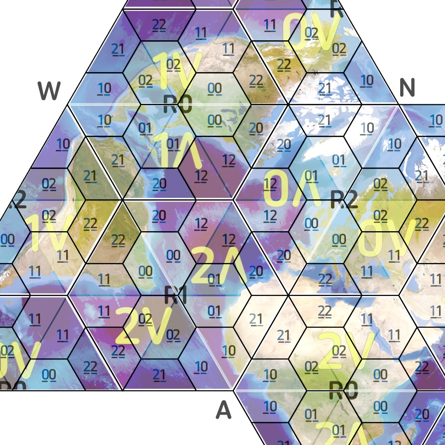

*<small>NWA Detail showing Layer 0 hexagon C2 addresses, C1 rotation labels, 
and Layer 1 hexagon numbers.</small>*

The next step will be to identify which of the three hexagons (NA, NW, WA) 
the coordinate belongs to.

#### Flattening to barycentric
We now implement the appropriate matrix transform for that octant. This will 
convert the point to an equilateral triangle with side length √2, centred at 
the orign accordingly.  We must handle the two modes, as before - and rather 
than switching the grid we shall, again, invert the triangle for the `V` mode. 

In the flattening, we will normalise the orientation of each face such that 
it's central apex will be either `N`, the North Pole or `S`, the South Pole.

*Example: `(0.42534401 -0.01177462  0.56288137)` address above is now converted
to `(0.29243772 0.28113778)` in `NWA`, with mode `Λ`*

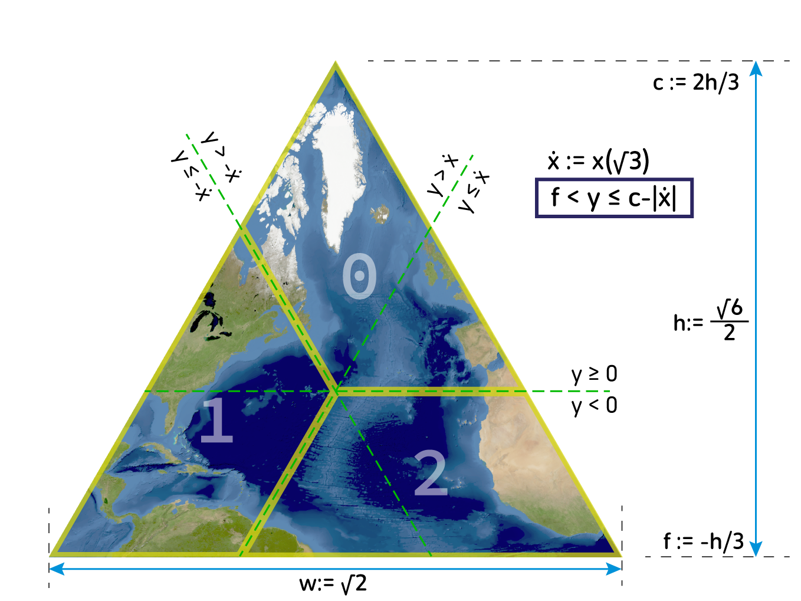

*<small>NWA Layer 0 hexagon C2 addresses in normalised rotation, with 
the origin at barycentre showing inequalities</small>*

We now require a set of inequalities that will determine the point's address.

#### Symbolic Definitions

*Because we are working on equilateral triangles, most of our inequalities will
involve `√3`.*

* `w := √2`   The triangle side length
* `h := √6/2` The triangle height
* `ẋ := √3(x)` (where `x,y` are the input coordinates)
* `ẇ := √2/√3`  used for x offsets 

#### Scope test
Given the constraints for octahedral coverage, it is not likely that a point 
will **not** appear out of scope (i.e., lying outside the triangle) - however, 
it is useful to test scope in order to ensure that no bugs have crept in. 
Points out of scope are **rejected**.  

##### `Λ` triangle
* `c := 2h/3` ceiling: maximum legal `y` value
* `f := -h/3` floor: minimum legal `y` value

Point `p` is **in scope** if it satisfies `f < y ≤ c-|ẋ|`

##### `V` triangle
* `c := h/3` 
* `f := -2h/3`

Point `p` is **in scope** if it satisfies `f+|ẋ| < y  ≤ c`

#### Identifying Layer 0 Hexagon.

We now identify which of the three half-hexagon sectors the point lies in, which
identify the `Layer 0 Hexagon`.


*<small>NWA Layer 0 hexagon C2 addresses in normalised rotation, with 
the origin at barycentre showing inequalities</small>*

##### `Λ`  Hexagon identity
As mentioned earlier, we must use a different mechanism for C1, however we 
can identify the related half-hexagon and the mode persists as before.

* When `y ≥ 0` and `y > -ẋ` then the point is in`0`
* When `y ≤ -ẋ` and `y > ẋ` then the point is in`1`
* When `y < 0` and `y ≤ ẋ` then the point is in`2`

##### `V` Hexagon identity

* When `y ≥ 0` and `y > -ẋ` then the point is in`0`
* When `y ≤ ẋ` and `y < 0` then the point is in`1`
* When `y ≤ -ẋ` and `y > ẋ` then the point is in`2`

###### Example continued.

`(0.29243772 0.28113778)` in `NWA`, with mode `Λ`

`ẋ := 0.50651698` (0.29243772 * √3)
`y := 0.28113778`
`y ≥ 0 and y > -ẋ`, so the point is in the polar hex `0`

*The related edges/hexagons of NWA are as follows, and we are now able to 
use the `C2` value to identify the Hexagon*

| Ch | Name              | Faces     | C2 | R |
|----|-------------------|-----------|----|---|
| NA | North Atlantic    | NWA, NEA  | 0  | 2 |
| NW | North West        | NWA, NWP  | 1  | 0 |
| WA | West Atlantic     | NWA, SWA  | 2  | 1 |

*So we are in the half-hexagon `NAΛ`*,
*The `C2` is 0, and the rotation `R` is `2`.*

#### Identification of **child** `C2`

While this has provided us with the hexagon for the current layer we
normally want the full address, and so we  need the next `C2` value.
Each half-hex may be further divided into three triangles identified by 
their *intersection identities*.  


These are easier to identify with the following diagram, while recognising the
C0 orientation.


##### `Λ` Identification of **child** `C2`

For points in `0Λ` (flat),

* `y ≤ -ẋ` identifies `021`
* `y < -ẋ` and `y > ẋ - ẇ` identifies `201`
* `y ≤ ẋ - ẇ` identifies `102`

For points in `1Λ` (forward),

* `y ≥ 0` identifies `102`
* `y < 0` and `y > -ẋ-ẇ` identifies `120`
* `y ≤ -ẋ-ẇ` identifies `210`

For points in `2Λ` (back),

* `y ≤ ẋ` identifies `210`
* `y > ẋ` and `y < h/3` identifies `012`
* `y ≥ h/3` identifies `021`

##### `V` Identification of **child** `C2`

For points in `0V` (flat),

* `y ≥ ẋ` identifies `012`
* `y < ẋ` and `y < ẇ-ẋ` identifies `210`
* `y ≥ ẇ-ẋ` identifies `120`

For points in `1V` (forward),

* `y ≥ -ẋ` identifies `201`
* `y > -h/3` and `y < -ẋ` identifies `021`
* `y ≤ -h/3` identifies `012`

For points in `2V` (back),

* `y ≤ 0` identifies `120`
* `y > 0` and `y < ẇ+ẋ` identifies `102`
* `y ≥ ẇ+ẋ` identifies `201`

#### Offset coordinates

We then offset the original coordinates to centre the identified triangle for
the next iteration,
we calculate `(x’, y’)` using the offset in accordance with `C1` and **child
** `C2`:
*where `u` := `w/6`, `v` := `h/9`*


* `0Λ.021` : x, y+2v
* `0Λ.201` : x-1u, y+1v
* `0Λ.102` : x-2u, y+2v
* `1Λ.102` : x+1u, y-1v
* `1Λ.120` : x+1u, y+1v
* `1Λ.210` : x+2u, y+2v
* `2Λ.210` : x-1u, y-1v
* `2Λ.012` : x, y-2v
* `2Λ.021` : x, y-4v


* `0V.012` : x, y-2v
* `0V.210` : x-1u, y-1v
* `0V.120` : x-2u, y-2v
* `1V.201` : x-1u, y+1v
* `1V.021` : x, y+2v
* `1V.012` : x, y+4v
* `2V.120` : x+1u, y+1v
* `2V.102` : x+1u, y-1v
* `2V.201` : x+2u, y-2v

#### Scaling coordinates and re-iteration

We now multiply both `(x’, y’)` by 3 and are ready for the next iteration,
storing the
identified hex, and passing `(x’, y’)` and **child** `C2`.

We might continue to do this until we start seeing numerical errors which, for
64 bit machines, happens after about 30 iterations.
The algorithm is fast: It depends solely on inequalities and one multiplication
of the x coordinate with √3 per
iteration.

##### Example

Given the point `(0.2924332269536584, 0.28114591390120613)` and initial `C2`
of `021` the algorithm returns `520352116102665517712277467235V`.
If the length of one side of initial triangle were 1000km, this address 
identifies a region less than 1 attometer^2 - so any errors will 
be arising via projections, not from the address translations.

#### Unravelling H9 addresses

While an H9 address is compact, it is often useful to have the `VΛ` values at
each stage, as this helps to identify
which particular half-hexagon to follow - this is most relevant when dealing
with the orphan hexagons 6,7,8.
This is best done in reverse, as we can avoid the use of a stack when resolving
apparent ambiguities.
Given the `VΛ` convention we can assume that the final region is `V` if it is
undefined.

#### Unravelling algorithm

This works by recognising that there is a strong relationship between parent and
child, and that the child's triangle
identity
uniquely identifies the parent's mode.  
For example, consider the half-hexagon `6V`.
If it belongs to a parent `6` hexagon, that parent half-hexagon must be `6Λ`.
Whereas for half-hexagon `0V`, if it belongs to parent `0`, that parent
half-hexagon must be `0V`.
There are four cases - where the parent identity is strongly fixed (for example
a child `2` of parent `0` only occurs
when `0` is `0V`)

```python
def unravel(par, curr, t_id):
    # C2 can be seen as distance from Centre (0,1,2)
    # C1 can be seen as orientation (–,/,\ for 0,1,2 respectively).
    # Given a parent/child address (with child half-hex VΛ) we calculate the
    # parental half-hex identity. EG, for par=3, curr=5, t_id='V', return 'Λ'
    lut = [t_id, 'V', 'Λ', 'Λ' if t_id == 'V' else 'V']
    c2, c1 = divmod(curr, 3)  # unpack base 3 values.
    p_c1 = par % 3  # we only use the c1 value of parent.
    if c2 != 1:
        idx = (p_c1 - c1) % 3
    else:
        idx = (c1 - p_c1) % 3
    return lut[idx] if c2 != 2 else lut[3] if idx == 0 else lut[0]
```

##### Example

Given the address `520352116102665517712277467235V`,
it is unravelled
to `5Λ2Λ0Λ3Λ5V2V1Λ1Λ6Λ1V0V2V6V6Λ5V5V1Λ7V7Λ1Λ2V2V7V7Λ4Λ6Λ7Λ2V3Λ5V`
It is trivial to *ravel* the address merely by removing the triangle identities.

#### Inverse Operation.

Given the address `520352116102665517712277467235V` it is easy enough to derive
it's XY coordinate pair
`(0.2924332269536584, 0.28114591390120613)` by unravelling the address and
reversing the conversion process.


# Bibliography

`Tilings and Patterns` Grünbaum & Shephard (1987)
`Hexagonal Inflation Tilings and Planar Monotiles`  Michael Baake, Franz Gähler,
Uwe Grimm
`An aperiodic monotile` David Smith1, Joseph Samuel Myers, Craig S. Kaplan,
Chaim Goodman-Strauss
`Something about Dymaxion` Buckminster Fuller, (and Snyder).
`https://math.stackexchange.com/questions/5016695/` Anders Kaseorg 2025.  