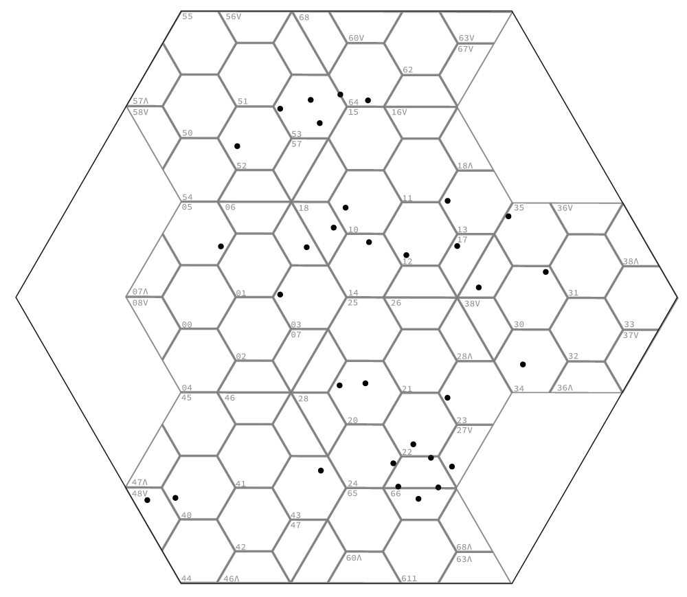

# `H9` An hierarchic hexagonal grid
This is a solution to the challenge of generating a hierarchic hexagonal grid. While there have been many approaches to this challenge over the last few decades, this solution (`H9`) may have significant benefits over others that are more well known.

## Why hierarchic hexagonal grids?
The motive for doing this is covered across many papers and even standards but, in two sentences,
* The hexagonal tiling is unique amongst regular tilings in that all neighbours are edge on.
* The hexagonal tiling is identical to the best fit circle packing.  

The underlying insight in *this (`H9`)* solution is that, while hexagons cannot tile hexagons, a half-hexagon can be tiled by half-hexagons.

Half-hexagons have a history of their own in tilings. In their chapter on aperiodic tilings, Grünbaum & Shephard, (also Baake et al.), bring note to some of the issues of using the 1:4 (50%) hierarchy - 


*<small>aperiodic half hexagonal grid</small>*

While aperiodic tilings are always interesting (cf. Penrose Tiling, and the recent Aperiodic Monotile discovery by Smith et al) I am not convinced they are so useful for GIS, mapping, or simulations where a primary criterion of a hierarchic grid is that it **is** periodic.

Nevertheless, if one were to ignore the underlying generator, such a grid could be feasible, as the 

However, the 1:9 (33.33%) hierarchy can offer a very strong regularity, and the 1:9 ratio is far more similar to the 1:10 ratio we are used to on metrical / decimal grids.


One aspect of the grid generator depicted above is that (unlike the 1:4) it is not unique. In the course of writing this, the enumeration of all 49 possible 1:3 tilings of the half-hexagon were identified.
The image below depicts all of them.  Of these, eight pairs (mirrors of each other) can be used to tile the plane in hexagons – and of those just one (as depicted above) has a symmetry other than the wallpaper group `p1` - not only that, but it has a symmetry `p31m` which works very well both on the plane and for a sphere. 


We can therefore determine that, as a candidate, this tiling of a half-hexagon hierarchy might lend itself very well to the purpose of generating a hierarchic hexagonal grid. 

## Challenges
One is immediately drawn to a few potential setbacks.
1. The 'child' hexagons are split across the parents.
2. The use of mirrors in symmetry is not great for mapping.
3. The basic tile does not work on icosahedral spherical mappings.
4. A grid should provide meaningful, intuitive, enumeration such that generates a unique location.
Let us address those in order:

## (1) The 'child' hexagons are split across the parents.
This is the case with *every* hierarchic hexagonal grid; however with `H9` planar grid there are no new shapes other than the half-hexagon and the hexagon; this lends itself to very deep hierarchies without having to be concerned about changes in orientation as one transposes from one level to the next.

Moreover, because there is no overlap (apart from the horizontal split), there is very little ambiguity.
Using the symmetry of the underlying pattern as guidance, we can identify each hexagon uniquely - but for the innermost hexagon, it is salient - even necessary - to include the innermost half-hexagon region. This will be examined in detail later. 

### Conclusion
Given that there is no means of tiling hexagons with hexagons, `H9` keeps the discontinuity to a minimum, adding only one new polygon - which is easily recognised. The addressing issue is important, but will be examined later.

## (2) The use of mirrors in symmetry is not great for mapping
The symmetry (wallpaper group) `H9` is `p31m` - not `p6` (as found in hexagons). 


*<small>p31m wallpaper symmetry</small>*

The important aspect of the half-hexagons is that they provide the framework for the hierarchic hexagonal grid.  However, the grid itself - at each level - is a hexagonal grid. Each grid hexagon is easily divided into two half-hexagons without adding any new vertices - each of which are, again divided into nine half-hexagons themselves requiring only 11 new vertices, all of which are easily derived from the parent due to the three equilateral triangles that they are composed by. 

Those 18 half-hexagons yield the entire outline of the hexagon child grid.  The symmetry of the half-hexagons is useful for identifying enumerations (which themselves help us develop an addressing schema), but the nature of the symmetry has little to do with the actual map.  However, there is a `side effect` of using this symmetry, which is that there is an implicit orientation (an 'up') built into the planar grid itself.

### Conclusion
The half-hexagon symmetry is only a structural component for the hierarchic hexagonal grid it depicts.

## (3) The basic tile does not work on icosahedral spherical mappings.
This may well be a reason why the tiling was discarded as a candidate in the past.  However it is well known (vis. Fuller's work on this - such as the Dymaxion projection) that the spherical (or spheroidal) mapping using icosahedra involves inflections that require a minimum of 12 pentagons. This itself demonstrates the complexity of using a hexagonal mapping of the sphere. 
An alternative to the icosahedron/dodecahedron dual is the cube/octagon dual.  While it requires more topological stretching (something that will be addressed later) the octagon lends itself very well to the human division of the sphere into hemispheres. 

Within the spherical symmetry groups,  octahedral symmetry (Coxeter `[*432]`) has many similar features to icosahedral (Coxeter `[*532]`) - yet switching the 5 for 4 addresses the exotic equatorial zigzag.
Using the `H9` tiling on an octahedral base is pretty strong at (Coxeter `[3+,4]`) - nevertheless it is a pyritohedral symmetry (which itself uses roto-reflections - a 3D symmetry function which reflects and rotates at the same time).

As this is a grid system, it isn't tied to any particular methodology - but an example of one projection onto the plane is as follows


*<small>octahedral map projection</small>*


*<small>An octahedral detail of australasia, using the matplotlib dataset.</small>*

For on-sphere maps we can begin to approximate near-equivalent areas. 
As the underlying grid is a triangular subgrid of an octahedron it is possible to use
various well-known means to optimise the grid to fit the sphere, such as Lloyd's voronoi relaxation,
or force-directed methods such as kamada kawai.
The following is an example of the latter. 


There are also analytic methods such as suggested by Anders Kaseorg.

### Conclusion
While `H9` does not map onto an icosahedron (for the simple reason that the grid requires that each of the  governing polyhedron's vertices have an even number of edges) it lends itself very well to mapping onto an octahedron, and does so following well-known spherical symmetry. 


*<small>The di-dodecahedron (also known as a diploid in crystallography) is an example of this symmetry.</small>*

##  4. A grid should provide meaningful enumeration

Let us first tile the plane.

Starting with a parallelogram of six half-hexagons


*<small>p31m parallelogram tile</small>* 

The image shows the p31m symmetry of the grid.
This covers the plane. 


While the grid appears oriented there is only one symmetrical solution (a mirror = 180º rotation).

Looking at the unit parallelogram, the largest feature are the two triangles which are **mirrors** of each other.


For encoding purposes let us name the left triangle `V` (Latin Vee V), and the right triangle `Λ` (Greek Lambda Λ). Being mirrors these names have some sort of intuitive sense - the "VΛ" orientation as shown in the parallelogram unit was chosen just because hotel lifts (US-english: elevators) normally have the 'down' arrow on the left, and the 'up' arrow on the right.

Within each of these triangles is a triad of half-hexagons.
They inherit their triangular name as an attribute of their identity.  As depicted, the three half-hexagons on the left are attributed `V`, while the three half-hexagons on the right are attributed `Λ`.  We will call this the `triangle identity` of the half-hexagon. It can be seen at this point that **every hexagon in the grid consists of one `V` and one `Λ` half-hexagon**.


One can also see that every edge of a `V` neighbours a `Λ`.
This division into is `V` and `Λ` helps us to identify the three orientations to the hexagon. The hexagon is 'patterned' by the half-hexagon line. 


Uncoloured, the 'patterned' hexagon grid is identical to the half-hexagon grid - it's just that the long line of the constituent half-hexagon is now considered to be the hexagon's pattern.  So, while an un-patterned hexagonal grid belongs to the wallpaper group `p6`, the patterned `H9` hexagonal grid is an instance of the `p31m` group.

Back to the main purpose, we are interested in establishing a hexagonal grid identity - so we want to be able to enumerate the hexagons in manner that is directly related to how it is generated.

Grünbaum/Shephard 1986 establish that for `p31m` there are exactly two periodic colourings using three colours. It's not too hard to see that there are only two possible tilings of three colours as depicted below.


*<small>The two periodic colourings of `p31m`</small>* 

'Colouring' here is not constrained (as is found in much of this area of mathematics, like the four-colour theory) to adjacent tiles being differently tiled: It's just a permutational constraint. Also, remember here that we are colouring the hexagons, **not** the half-hexagons.


*<small>Grünbaum/Shephard colourings of `p31m`</small>* 


If we overlay the hexagons and colour them accordingly..


*<small>Grünbaum/Shephard colourings of `p31m` overlaid with `H9`</small>* 

While Grünbaum/Shephard name the variations as <code>p31m[3]<sub>1</sub></code> and <code>p31m[3]<sub>2</sub></code> we can choose to be parsimonious and call them `C1` and `C2` respectively.

Note that colouring `C1` is already familiar to us - it is equivalent to the orientation of half-hexagon line as seen on the 'patterned hexagon'.

However `C2` creates oriented clusters of three-hexagon 'super-tiles', the members of which have a different orientation.  None of this is surprising - it is merely an effect of the permutations in this symmetry.

Given we have two colourings `C1` and `C2` (along with the triangle identities) we can use these aspects of the `p31m` symmetry to enumerate the grid.

In general numbering colourings is arbitrary - so we want to look at the features of the hexagons that share the same colours, and see if we can identify some sort of order – from which we can determine a number.

Given that the child grid hexagons are one ninth the area of their parent we should be expecting a base 9 value for each hexagon. As there are also two colourings of three colours to the grid, we should expect one to give us the upper trit, and the other to give us the lower trit of the two digit base 3 equivalent.

We can visualise this use a blue component colouring for `C1` and a red component colouring for `C2` and overlay them using an RGB additive overlay.


*<small>RGB overlay of `p31m` colourings `C1` and `C2`</small>* 

`C2`, the colouring of which clusters hexagons, is intuitively centred on a cluster.

Permutations over the two colourings entail six different numbering schemes – while any of them would suffice, it is always useful to find an approach that is intuitive.


*<small>Six permutations of the `p31m` colourings `C1` and `C2`</small>* 

#### Enumeration of `C2`
For `C2`, the hexagons (when overlaid into a parent hexagon) can be seen to have an order regarding their closeness to the centre: The three triangles from the three hexagon centres - from which, having ordered them, we can number them 0,1,2


*<small>The triangles of three coloured centres of `C2`</small>* 

#### Enumeration of `C1`
There are three orientations of the hexagonal 'pattern' (the line that divides the two half-hexagons that compose it).

These orientations could be labelled 'flat', 'forward', 'back'  using shorthand  '—', '/', '\'  respectively. Unlike the enumeration of `C2`, there is no particular rationale to order these as shown below, as any one could be the first, and the ordering could be either clockwise or counter-clockwise any loss of meaning.  


*<small>The orientations coloured by `C1`</small>* 


#### Combining `C1` and `C2`
It is possibly of note that `C2` appears to be related to radial distance while `C1`appears to be related to rotation.

If we number each of the colourings for both `C1` and `C2`, and overlay them, we will see that every one of the nine permutations of `C1` and `C2` are uniquely identified, as implied in the RGB overlay shown earlier.

This gives us, albeit in base 3, an identity of each sub-hexagon under its parent, from `0` to `8`.


*<small>The orientations coloured by `C1` and `C2` combined.</small>* 

#### Half-hexagon enumeration.
Earlier on we defined the 'triangle identity' of each child half-hexagon.
By using these, and knowing that each hexagon is composed of one of each, we can enumerate the half-hexagons.


*<small>The triangle identities marked with names.</small>* 

We can now use those to identify and enumerate the half-hexagons. This will be useful for dealing with the 'orphan' hexagons `20`, `21`, `22`.


*<small>The half-hexagon enumerations in base3.</small>* 

Converting the base 3 digits might obscure their derivation, but it gives us a single digit base 9 identity for each hexagonal child.


*<small>Base 9 enumeration.</small>* 

This concludes the task of enumerating hexagon children of a parent. 

### Enumeration in hierarchical grids.
While there are numerous ways to represent a grid (including purely nominal systems like those used by what3words), the choice of enumeration typically depends on the intended purpose.

For example, a nominal grid uniquely identifies a specific area and is easy to communicate, but it lacks information about regional characteristics or relational identities.

Other types of grids include sector-oriented grids and distance-oriented grids, both of which serve different purposes.

In general, sector-oriented maps, (which often focus on density, regionality, growth, spread, availability, and other related concepts), are suitable candidates for hierarchical grids. Conversely, maps that involve directed travel are better suited for ordinal grids.

Hierarchical grids are most commonly focused on the same considerations used with sector-oriented systems, and the enumeration is best when it helps identify a location based on the hierarchy of sectors it belongs to. 

###  Enumerating the H9 grid.
Once we recognise the unique enumeration of the space of a hexagon (in this case in accordance with one of hexagons or half-hexagons that compose it) we can use a parental hierarchy to uniquely identify a point on the grid.

A concern arises — when we have two adjacent parents, there will be one hexagon shared between them, composed of the two 'orphan' hexagons `6`, `7`, `8` on each side. This can be illustrated with three adjacent hexagons `a, b, c`.


*<small>Orphan hexagons 6,7,8 marked in green</small>* 

While there is no doubt about base number of each hexagon, it shares two addresses - one from each half-hexagon.  

Assuming that we use the parent hexagon as a prefix of the current address, we can see that the '7' hexagon depicted above has the two unique addresses `a7V` and `c7Λ`. Given that `a` and `c` are themselves unique, we have a surfeit of addresses in this case.  

#### The `VΛ` convention.
While the two half-hexagon addresses are still informative, and will share meaning when subdividing this hexagon, we should hope for a 1-to-1 mapping. 
A trivial approach here is to use an order of precedence for the triangle identities `V` and `Λ`.  The choice of precedence is arbitrary, so we choose `V` over `Λ` as a convention, and name it the "`VΛ` convention" (pronounced "V-Lambda ", or "down before up" convention).  We can now address the subgrid uniquely, while maintaining the `V` and `Λ` for edges.


*<small>Orphan hexagons resolved following `VΛ` convention.</small>* 

#### Origin
While any origin is arbitrary let's consider the two primary topologies that concern hierarchic grids: The plane and the surface of a spheroid (or sphere).

We will assume a rule-of-thumb that we only need to include those points which are within context. 

##### Origin on the plane
We can define a hexagon such that its position and dimension can be chosen such that it includes every point in context. 

This is defined as the origin hexagon. Its address is `0`. If, at some future point, it is not large enough, we can subtend it within a parent (or parental generations) as long as we revise its address (and those of its descendants) accordingly.


*<small>Origin Hexagon with points of interest</small>* 

At this level of accuracy, every point of interest belongs to the same address: `0`.

----
Following the aforementioned enumeration scheme we can improve the accuracy one generation at a time, at each time prefixing the parent hexagon onto the address.
Because the hexagons 6-8 are split and on the edges we must include the triangle identity for those.
Fortunately the orientations of these are always the same - e.g,  `6V` is a 'boat' (with long edge up), while `6Λ` is an 'umbrella' with long edge down.


*<small>Hexagons 00 with points of interest</small>* 

At this accuracy there are nine points that share address 02.

#### Origin address redundancy

It should be now clear that, while the origin hexagon (on the plane) contains the entire context, the leading zero can be left implicit.

----
We can indefinitely continue to improve the accuracy one generation at a time at each level prefixing the parent hexagon onto the address.

Whenever we depict a half-hexagon on the edges of the grid we must include the triangle identity for those. For all other 'whole' hexagons we use the `VΛ` convention.  This might seem counter-intuitive at first, but all 'whole' hexagons will always have a unique position.  Take, for example, the case where one is examining a subregion of `6V`: It's composite children differ from `6Λ` except for when the two are conjoined. Therefore it is unnecessary to record the triangle identity for whole hexagons. 



*<small>Subgrid with fewer points of interest per hexagon.</small>* 

While this last image shows the outline of the parent grid it is trivial to remove it.


*<small>Subgrid with fewer points of interest per hexagon - no parent grid showing.</small>* 

#### Further refinement to the `VΛ` convention.
 When addressing children of orphans, addressing must follow the orphan address, not the `VΛ` convention address: In other words the `VΛ` convention relates only to the unique address of a hexagon at any given level of the hierarchy, and not to its offspring.

In the example being displayed most points now have a unique address - except at hexagons `53` and `66`. Because this is latter hexagon is an orphan within an orphan, it is possibly of value to examine a further subdivision of it so that we can demonstrate this refinement of the `VΛ` convention.

Recall that the two component addresses for `66` are `66V` and `26Λ`. (We can always derive the two orphan addresses from a `VΛ` convention address.  In this particular case, we have the `66V` orphan of half-hexagon `6`, and the `26Λ` orphan of `2`). 

In the following figure it is apparent that the nine child addresses: those which are either whole hexagons or hold the `V` triangle identity are entirely governed by the parent half-hexagon, while the `Λ` addresses are handled by its neighbours (unless at the edge of the grid).


*<small>Subgrid with fewer points of interest per hexagon - no parent grid showing.</small>* 

At this point it is possible to identify all the sample point addresses uniquely. If further precision is required one may follow the same steps recursively.

We now have defined a method for deriving a unique address for any point on the plane.

## Address conversion
An important function, especially when dealing with heterogenous data sources, is to develop functions that readily allow for lossless conversion from other address systems.
For the Euclidean plane, we would a function that converts (x,y) to an H9 address, as well as it's inverse.

#####  Address Algorithm
The approach is based on an equilateral triangle with a side length of √2, and the origin at its barycenter.
Any points outside this triangle will be rejected as out-of-scope.
We need two inputs:

1. The xy coordinate pair, and
2. The *intersection identity*.

Recollecting `C1`/`C2` enumeration,


The *intersection identity* is indicated by the `C2` (high trit) components of the three hexagons that the triangle holds a half of each, following `C1` (low trit) order.
* `021`, `102`, `210` indicate `Λ`
* `012`, `120`, `201` indicate `V` 

*(Here C1 addresses are marked with a trailing triangle identity in order to signify them)*


We now require a set of inequalities that will determine where the point is.
#### Symbolic Definitions
*Because we are working on equilateral triangles, most of our inequalities will involve `√3`.*

* `w` The side length is a synonym for `√2`
* `h` The derived triangle height  is `√6/2`
* `ẋ` is a synonym for `√3(x)` (where `x,y` are the input coordinates)
* `ẇ` is a synonym for `w(√3/3)` (used for x offsets)

#### Scope test
It is important to verify that the point is **in scope** - i.e., it lies within the triangle.

##### `Λ` triangle (`021`, `102`, `210`)  
Using
* `c` (ceiling - max. `y`) as a synonym for `2h/3`
* `f` (floor - min. `y`) as a synonym for `-h/3`

The point is **in scope** (within the triangle) if it satisfies

`f < y ≤ c-|ẋ|`

##### `V` triangle (`012`, `120`, `201`)  
Using
* `c` (ceiling - max. `y`) as a synonym for `h/3`
* `f` (floor - min. `y`) as a synonym for `-2h/3`

The point is **in scope** (within the triangle) if it satisfies

`f+|ẋ| < y ≤ c`

#### Identifying the C1 address  
Points out of scope are **rejected**.  
We now identify which of the three half-hexagon sectors the point lies in, which identify the `C1` sector.

###### `Λ` triangle C1 identity
* When `y < 0` and `y ≤ ẋ` then the point is in`0Λ` 
* When `y ≤ -ẋ` and `y > ẋ` then the point is in`1Λ`
* When `y ≥ 0` and `y > -ẋ` then the point is in`2Λ`

###### `V` triangle C1 identity
* When `y ≥ 0` and `y > -ẋ` then the point is in`0V` 
* When `y ≤ ẋ` and `y < 0` then the point is in`1V`
* When `y ≤ -ẋ` and `y > ẋ` then the point is in`2V`

#### Hexagon Identity
Using the passed `C2` parameter (as a 3 digit tuple) we can now identify the hexagon.

```python
c1 = 1        # identified C1 `1Λ`
c2 = 0,2,1    # intersection identity parameter 
hx = c2[c1]*3 + c1  # hex number (7)
```

#### Identification of **child** `C2`
While this has provided us with the hexagon region for the current layer we normally want the full address, and so we need the next `C2` value.
Each `C1` region may be further divided into three triangles identified by their *intersection identities*.  
These are easier to identify with the following diagram, while recognising the C0 orientation.


##### `Λ` Identification of **child** `C2`
For points in `0Λ` (flat), 
* `y ≤ -ẋ` identifies `021`
* `y < -ẋ` and `y > ẋ - ẇ` identifies `201`
* `y ≤ ẋ - ẇ` identifies `102`

For points in `1Λ` (forward),
* `y ≥ 0` identifies `102`
* `y < 0` and `y > -ẋ-ẇ` identifies `120`
* `y ≤ -ẋ-ẇ` identifies `210`

For points in `2Λ` (back),
* `y ≤ ẋ` identifies `210`
* `y > ẋ` and `y < h/3` identifies `012`
* `y ≥ h/3` identifies `021`

##### `V` Identification of **child** `C2`
For points in `0V` (flat), 
* `y ≥ ẋ` identifies `012`
* `y < ẋ` and `y < ẇ-ẋ` identifies `210`
* `y ≥ ẇ-ẋ` identifies `120`

For points in `1V` (forward),
* `y ≥ -ẋ` identifies `201`
* `y > -h/3` and `y < -ẋ` identifies `021`
* `y ≤ -h/3` identifies `012`

For points in `2V` (back),
* `y ≤ 0` identifies `120`
* `y > 0` and `y < ẇ+ẋ` identifies `102`
* `y ≥ ẇ+ẋ` identifies `201`

#### Offset coordinates
We then offset the original coordinates to centre the identified triangle for the next iteration, 
we calculate `(x’, y’)` using the offset in accordance with `C1` and **child** `C2`:
*where `u` := `w/6`, `v` := `h/9`*


* `0Λ.021` : x, y+2v
* `0Λ.201` : x-1u, y+1v
* `0Λ.102` : x-2u, y+2v
* `1Λ.102` : x+1u, y-1v
* `1Λ.120` : x+1u, y+1v
* `1Λ.210` : x+2u, y+2v
* `2Λ.210` : x-1u, y-1v
* `2Λ.012` : x, y-2v
* `2Λ.021` : x, y-4v


* `0V.012` : x, y-2v
* `0V.210` : x-1u, y-1v
* `0V.120` : x-2u, y-2v
* `1V.201` : x-1u, y+1v
* `1V.021` : x, y+2v
* `1V.012` : x, y+4v
* `2V.120` : x+1u, y+1v
* `2V.102` : x+1u, y-1v
* `2V.201` : x+2u, y-2v

#### Scaling coordinates and re-iteration
We now multiply both `(x’, y’)` by 3 and are ready for the next iteration, storing the 
identified hex, and passing `(x’, y’)` and **child** `C2`.

We might continue to do this until we start seeing numerical errors which, for 64 bit machines, happens after about 30 iterations.
The algorithm is fast: It depends solely on inequalities and one multiplication of the x coordinate with √3 per iteration. 

##### Example
Given the point `(0.2924332269536584, 0.28114591390120613)` and initial `C2` of `021`
the algorithm returns `520352116102665517712277467235V`.
If our initial triangle covers the area representing 1/8 the earth surface, this address identifies a region just under 1.1 attometer^2
If our initial triangle covers the area representing 1/8 the earth surface, this address identifies a region just under 1.1 attometer^2
Normally addresses such as `520352116102665V` should suit, being accurate to less than 1m^2.

### Unravelling H9 addresses
While an H9 address is compact, it is often useful to have the `VΛ` values at each stage, as this helps to identify which particular half-hexagon to follow - this is most relevant when dealing with the orphan hexagons 6,7,8.
This is best done in reverse, as we can avoid the use of a stack when resolving apparent ambiguities.
Given the `VΛ` convention we can assume that the final region is `V` if it is undefined.

#### Unravelling algorithm
This works by recognising that there is a strong relationship between parent and child, and that the child's triangle identity
uniquely identifies the parent's triangle identity.  
For example, consider the half-hexagon `6V`. 
If it belongs to a parent `6` hexagon, that parent half-hexagon must be `6Λ`. 
Whereas for half-hexagon `0V`, if it belongs to parent `0`, that parent half-hexagon must be `0V`.
There are four cases - where the parent identity is strongly fixed (for example a child `2` of parent `0` only occurs when `0` is `0V`)
```python
def unravel(par, curr, t_id):
    # C2 can be seen as distance from Centre (0,1,2)
    # C1 can be seen as orientation (–,/,\ for 0,1,2 respectively).
    # Given a parent/child address (with child half-hex VΛ) we calculate the
    # parental half-hex identity. EG, for par=3, curr=5, t_id='V', return 'Λ'
    lut = [t_id, 'V', 'Λ', 'Λ' if t_id == 'V' else 'V']
    c2, c1 = divmod(curr, 3)  # unpack base 3 values.
    p_c1 = par % 3  # we only use the c1 value of parent.
    if c2 != 1:
        idx = (p_c1 - c1) % 3
    else:
        idx = (c1 - p_c1) % 3
    return lut[idx] if c2 != 2 else lut[3] if idx == 0 else lut[0]
```

##### Example
Given the address `520352116102665517712277467235V`, 
it is unravelled to `5Λ2Λ0Λ3Λ5V2V1Λ1Λ6Λ1V0V2V6V6Λ5V5V1Λ7V7Λ1Λ2V2V7V7Λ4Λ6Λ7Λ2V3Λ5V`
It is trivial to *ravel* the address merely by removing the triangle identities.

### Inverse Operation.
Given the address `520352116102665517712277467235V` it is easy enough to derive it's XY coordinate pair
`(0.2924332269536584, 0.28114591390120613)` by unravelling the address and reversing the conversion process.

### Origin on the spheroid (or sphere).
Especially on the spheroid the natural origin is the axis of rotation. As mentioned above, the icosahedron projection is not so useful due to the fact that there are five edges meeting each vertex - and the reflective nature of `p31m` requires and even number of edges to meet at each vertex. This nature, as suggested earlier, lends itself very well to a `pyritohedral symmetry` following the structure of a pole-aligned octahedron.

While it may be considered an issue that the octahedron does not fit as well within a sphere as an icosahedron (or dodecahedron) does - we can adjust for that numerically.

Following any form of polyhedral projection, we can expect some degree of distortion of the grid at the vertices.

Bearing this in mind let us consider the octahedron as the basis of a grid.

##### Octahedron projection
The grid lends itself particularly well to subdivision of an equilateral triangle - so the faces of the octahedron can readily be mapped using little more than naive subdivision.
In this case we are fixing the octahedron at the poles and the equator using the prime meridian to determine vertices.

Vertices: `NSWEPA`
* The Polar Vertices (varying Latitude):
    * `N`: North Pole  (+90º)
    * `S`: South Pole  (-90º)
* Four Equatorial Vertices  (varying Longitude):
  * `W`: West Equator (-90º)
  * `E`: East Equator (+90º)
  * `P`: Prime Meridian (0º)
  * `A`: Anti-Meridian (180º)

While there is a chiral option, we shall consider configuration where is a *defining* hexagon that has a vertex at the North Pole and is subdivided by the Prime Meridian

We can now name each hexagon by its division line and the vertex it touches.  For example, the *defining* hexagon would be `NP`


*<small>Labelled Octahedral Projection showing origin hexagons.</small>*

In this scheme each of the 12 hexagons that cover the sphere are a root of the grid. While they have good properties of neighbourhood - they do not have a coherent 'parent' grid, and are best related via their neighourhood.  It can be readily seen that there is no coherent parent: Let's examine the partial hexagon centred at N, bounded by vertices AWPEA, where NA would be identified as hexagon `0` - we immediately notice that it is also hexagon `1`. This is because each of the vertices of the octahedron have only two adjacent hexagons but the grid design requires three.

Nevertheless, choosing a group of 12 hexagons as the basis of the grid has no significant drawbacks: Indeed, it becomes quite easy to recognise that PE covers Africa, NP covers Europe and the North Atlantic, WN covers most of North America ... and so on. 

Therefore, this serves well as an origin for geographic and spherical mapping.


# Bibliography
`Tilings and Patterns` Grünbaum & Shephard (1987)
`Hexagonal Inflation Tilings and Planar Monotiles`  Michael Baake, Franz Gähler, Uwe Grimm 
`An aperiodic monotile` David Smith1, Joseph Samuel Myers, Craig S. Kaplan, Chaim Goodman-Strauss
`Something about Dymaxion` Buckminster Fuller, (and Snyder).
`https://math.stackexchange.com/questions/5016695/` Anders Kaseorg 2025.  