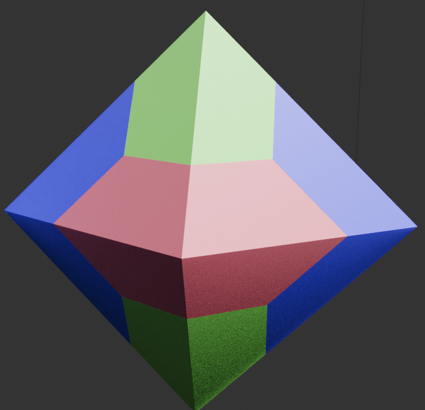
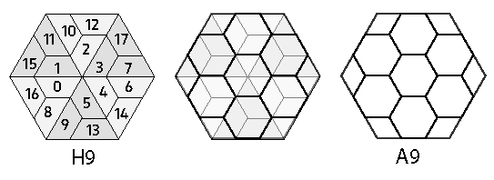
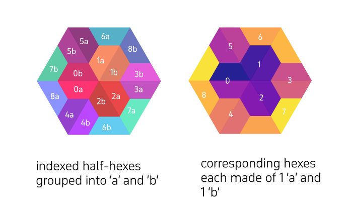
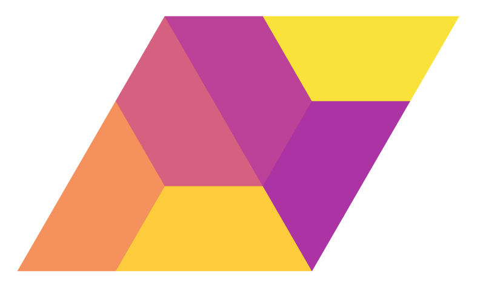
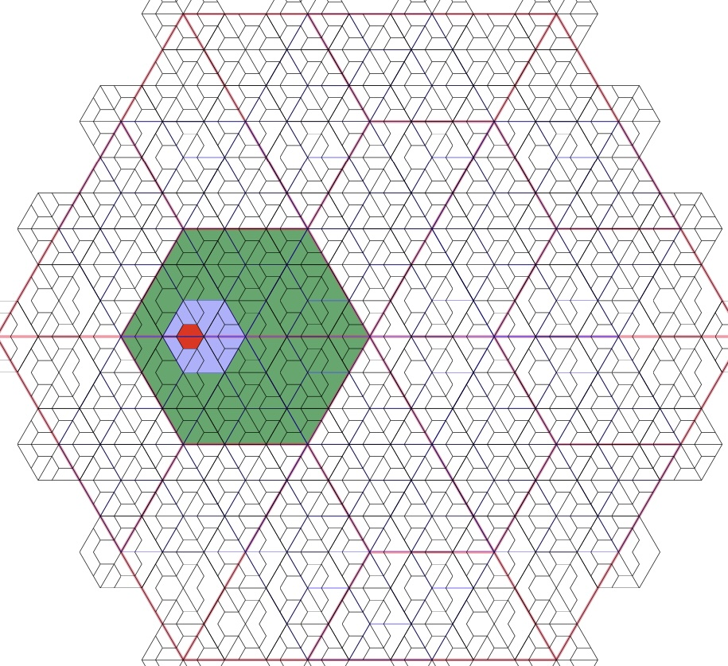
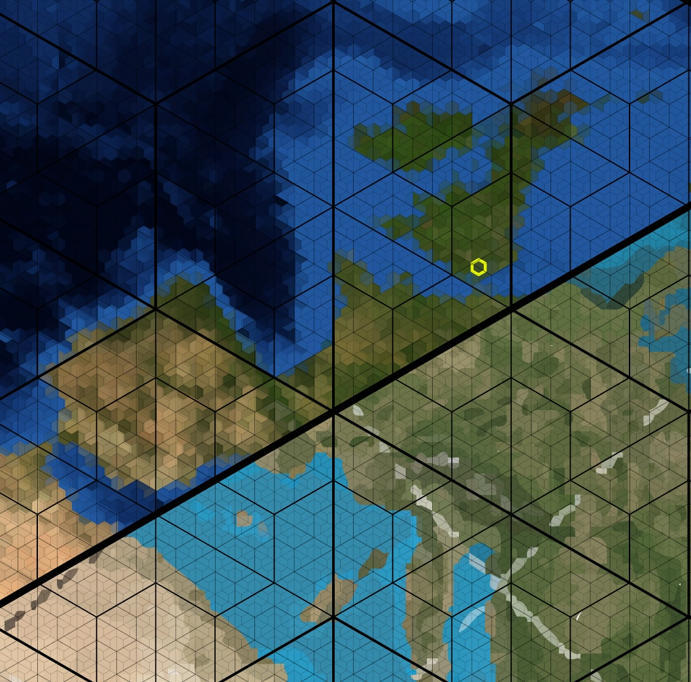

In early 2024, I recognised that there might be a novel approach based upon a 
single, fundamental insight:

**While one cannot tile hexagons with hexagons, one can tile half-hexagons 
with half-hexagons**

While this journey is far from over, this one insight has already yielded 
really exciting fruits - not all of which are novel, and many of which might be 
used advantageously in any hierarchic grid based on triangular projections.

## The Hex9 Environment
The Hex9 depends upon a global, hierarchical triangular grid, generated by 
subdividing the faces of a fundamental `octahedron`, whose vertices are 
fixed at the poles and at 0°, 90°, 180°, and 270° along the equator. This provides a 
consistent tessellation suitable for multi-resolution spatial analysis.

A key advantage of using an `octahedron` is that each vertex connects an even 
number of triangular faces (four at the poles, and four along the equator 
intersections). This allows each triangular face to be subdivided into three 
sub-triangles forming a half-hexagon, which aligns perfectly across neighboring faces. 
In contrast, an icosahedron has vertices with five faces, making this half-hexagon alignment impossible without distortion or irregular shapes.
The following image attempts to demonstrate the importance (under this system)
of using polyhedra that have vertices with an even number of edges.

(*Octahedra have four faces at each vertex*)

This image also demonstrates the 12 'Layer 0' hexagons, each of which are 
split across two faces (`octants`). This is a feature of Hex9.

Layer 1 is merely a subdivision of Layer 0,
with each Layer 0 hexagon being divided into 9 sub-hexagons (consisting of six 
whole hexagons, and 6 half-hexagons). Strictly speaking, we are subdividing 
the faces (`regions`) of the octahedron, of which the hexagons are an 
emergent feature.
(*Layer 1 as a net*)

My [new documentation](enumeration.md) 

[Documentation for the examples](examples/examples.md)

This project is centred on the idea of hierarchic hexagonal grids, with the 
primary insight that, while one cannot tile hexagons with hexagons one can 
tile half-hexagons with half-hexagons.  When one is looking at the 1:9 
ratio, there are 49 such tilings of which 1 pair works particularly well for 
hierarchic hexagonal tiling.

The use of half-hexagons ('regular' trapezoids composed of three equilateral 
triangles) as the primary fundamental resolves many of the issues that arise 
from hexagonal hierarchies.  

The work I did back in 2010 or so [past research](assets/docs/past.md) was 
based on something very similar to the H3 methods currently funded by Uber 
(the ride company), but I didn't like the ragged edges, and rotations 
required at each layer - moreover at that time I did not discover an address 
system that worked intuitively.

Below is the basic unit hexagon, showing its division into the 18 half-hexagons that compose it.  
The numbering is one way of indexing the half-hexagons, and is suitable for 
planar tiling.  When tiling the octahedron, one must adopt something a 
little more complex (only a small amount) in order to address edge 
transitivity. 

The plane can be tiled using the following:

A hexagonal grid hierarchy can be seen below, with the outer hexagon in white, 
then the successive lower hierarchies in green, blue and red. The hierarchy is unlimited in depth.

While independent of the display projection, the method *cannot* be used on any polyhedron projection, as the fundamental 
shape involves chained mirror-pairs:  It can only work on polyhedra 
which have an even number of edges attached to each vertex.
Therefore, it does NOT lend itself well when using global addresses on  
icosahedral maps, that have five edges from each vertex.  

This is not a major issue, however - the Octahedron is highly suitable for 
this hierarchy, and, though the octahedron itself tends towards greater 
distortion when used as a projection, for the purposes of generating 
hexagonal grid addresses, it works perfectly adequately.

The following shows an early version of the grid focussed on London.

### Grid referencing.
We can use an address system that resolves hierarchy and location extremely 
easily. One thing that I like is that we can use subtended regions rather 
than axis-oriented addresses. Why is that nice?  It offers a few benefits
- first of all there is only one string (unlike, EG lat/long or OS grids - which still confuse those not familiar with 
), and where locality can be kept relevant without having to consider a remote origin.

Another 'feature', is that from any given root, the length of the address tells us about the level of hierarchy. 
Moreover, merely by shortening the address, we may derive the layer ancestry.

Grid coordinates are best done, for this, using base 9, and using a signifier for the half-hex specialisation.
One can work out the entire half-hex address from a given hex address - but it does require following some rules.
